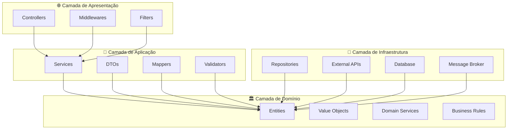
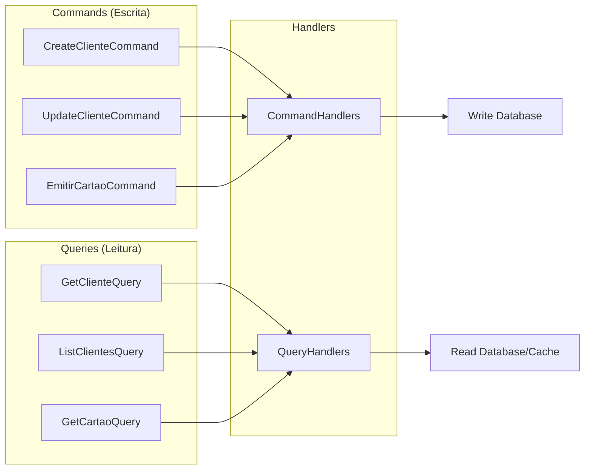
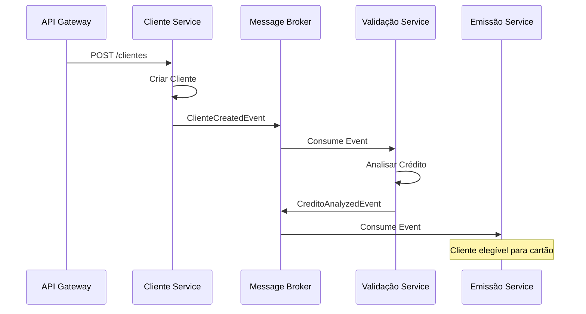

# 🏗️ Arquitetura do Sistema - Documentação Técnica

> **Padrões Arquiteturais e Design do Sistema de Gestão Financeira**  
> *Versão 1.0 - Novembro 2025*

---

## 📐 Visão Geral Arquitetural

O sistema segue uma **arquitetura de microserviços** baseada em **Clean Architecture** e **Domain-Driven Design (DDD)**, garantindo:

- ✅ **Separação clara de responsabilidades**
- ✅ **Alta testabilidade e manutenibilidade**  
- ✅ **Baixo acoplamento entre serviços**
- ✅ **Escalabilidade independente**
- ✅ **Flexibilidade para mudanças**

## 🎯 Padrões Arquiteturais Implementados

### 1. Clean Architecture (Arquitetura Limpa)



**Benefícios:**
- **Independência de frameworks:** Domínio não depende de tecnologias específicas
- **Testabilidade:** Cada camada pode ser testada isoladamente
- **Inversão de dependências:** Camadas externas dependem das internas
- **Flexibilidade:** Mudanças na infraestrutura não afetam regras de negócio

### 2. Domain-Driven Design (DDD)

#### Conceitos Aplicados:

**Entidades Ricas:**
```csharp
public class Cliente : BaseEntity
{
    // Propriedades privadas com métodos de negócio
    public void AtualizarRankingCredito(int novoRanking)
    {
        ValidarRanking(novoRanking);
        RankingCredito = novoRanking;
        AtualizarElegibilidadeCartao();
        DataAtualizacaoRanking = DateTime.UtcNow;
    }
    
    public bool PodeEmitirCartaoCredito()
    {
        return RankingCredito >= RANKING_MINIMO_CARTAO &&
               ScoreCredito >= SCORE_MINIMO_CARTAO;
    }
}
```

**Value Objects:**
```csharp
public class CPF
{
    public string Valor { get; private set; }
    
    public CPF(string cpf)
    {
        if (!ValidarCPF(cpf))
            throw new DomainException("CPF inválido");
        
        Valor = LimparCPF(cpf);
    }
}
```

**Aggregate Roots:**
- `Cliente` - Gerencia dados pessoais e elegibilidade
- `Card` - Controla ciclo de vida do cartão
- `CreditAnalysis` - Encapsula análise de crédito

### 3. CQRS (Command Query Responsibility Segregation)



**Vantagens:**
- **Performance otimizada:** Queries podem usar read models específicos
- **Escalabilidade:** Commands e queries podem escalar independentemente
- **Complexidade reduzida:** Separação clara entre operações de leitura e escrita

### 4. Event-Driven Architecture



**Eventos do Sistema:**
- `ClienteCreatedEvent` - Cliente cadastrado
- `ClienteUpdatedEvent` - Dados atualizados
- `CreditoAnalyzedEvent` - Análise concluída
- `CardIssuedEvent` - Cartão emitido
- `CardActivatedEvent` - Cartão ativado

---

## 🏛️ Estrutura Detalhada por Camada

### 1. Camada de Apresentação (Driving.Api)

**Responsabilidades:**
- Receber e validar requisições HTTP
- Serializar/deserializar dados
- Gerenciar autenticação e autorização
- Retornar respostas padronizadas
- Documentar APIs (Swagger/OpenAPI)

**Estrutura:**
```
Driving.Api/
├── Controllers/
│   ├── AuthController.cs        # Autenticação JWT
│   ├── ClientesController.cs    # CRUD de clientes
│   └── CartaoController.cs      # Gestão de cartões
├── Extensions/
│   ├── ServiceExtensions.cs     # DI configuration
│   ├── SerilogExtensions.cs     # Logging setup
│   └── SwaggerExtensions.cs     # API documentation
├── Middlewares/
│   ├── ExceptionMiddleware.cs   # Global error handling
│   ├── LoggingMiddleware.cs     # Request/response logging
│   └── RateLimitMiddleware.cs   # API throttling
└── Program.cs                   # Application startup
```

**Padrões Implementados:**
- **Response Wrapper:** Respostas consistentes com `ApiResponseDto`
- **Global Exception Handling:** Tratamento centralizado de erros
- **Input Validation:** Validação usando DataAnnotations e FluentValidation
- **Rate Limiting:** Proteção contra abuso de APIs

### 2. Camada de Aplicação (Core.Application)

**Responsabilidades:**
- Implementar casos de uso (use cases)
- Orquestrar chamadas para o domínio
- Mapear entre DTOs e entidades
- Validar regras de negócio
- Coordenar transações

**Estrutura:**
```
Core.Application/
├── Services/
│   ├── ClienteService.cs        # Casos de uso de clientes
│   ├── AuthenticationService.cs # Autenticação
│   └── CartaoService.cs         # Emissão de cartões
├── DTOs/
│   ├── Request/
│   │   ├── ClienteCreateDto.cs
│   │   ├── ClienteUpdateDto.cs
│   │   └── EmitirCartaoDto.cs
│   └── Response/
│       ├── ClienteResponseDto.cs
│       ├── ApiResponseDto.cs
│       └── CartaoResponseDto.cs
├── Mappers/
│   ├── ClienteMapper.cs         # AutoMapper profiles
│   └── CartaoMapper.cs
├── Validators/
│   ├── ClienteCreateValidator.cs # FluentValidation
│   └── CartaoValidator.cs
└── Interfaces/
    ├── IClienteService.cs
    └── ICartaoService.cs
```

**Exemplo de Implementação:**
```csharp
public class ClienteService : IClienteService
{
    private readonly IClienteRepository _repository;
    private readonly IMapper _mapper;
    private readonly IMessagePublisher _messagePublisher;
    private readonly ILogger<ClienteService> _logger;

    public async Task<ApiResponseDto<ClienteResponseDto>> CriarAsync(
        ClienteCreateDto dto)
    {
        try
        {
            // 1. Validar entrada
            var validationResult = await _validator.ValidateAsync(dto);
            if (!validationResult.IsValid)
                return ValidationErrorResponse(validationResult.Errors);

            // 2. Verificar duplicatas
            if (await _repository.EmailExisteAsync(dto.Email))
                return ErrorResponse("Email já cadastrado");

            // 3. Criar entidade
            var cliente = Cliente.Criar(dto.Nome, dto.Email, /* outros campos */);

            // 4. Persistir
            await _repository.AdicionarAsync(cliente);
            await _repository.SalvarAsync();

            // 5. Publicar evento
            var evento = new ClienteCreatedEvent 
            { 
                ClienteId = cliente.Id,
                Nome = cliente.Nome,
                Email = cliente.Email
                // outros campos
            };
            await _messagePublisher.PublishAsync(evento);

            // 6. Retornar resultado
            var response = _mapper.Map<ClienteResponseDto>(cliente);
            return SuccessResponse(response);
        }
        catch (Exception ex)
        {
            _logger.LogError(ex, "Erro ao criar cliente");
            return ErrorResponse("Erro interno do servidor");
        }
    }
}
```

### 3. Camada de Domínio (Core.Domain)

**Responsabilidades:**
- Definir entidades do negócio
- Implementar regras de domínio
- Validações de consistência
- Comportamentos específicos

**Estrutura:**
```
Core.Domain/
├── Entities/
│   ├── Cliente.cs               # Aggregate root
│   ├── Card.cs                  # Aggregate root
│   ├── CreditAnalysis.cs        # Aggregate root
│   └── Usuario.cs               # Entity
├── ValueObjects/
│   ├── CPF.cs                   # Value object
│   ├── Email.cs                 # Value object
│   └── Score.cs                 # Value object
├── Enums/
│   ├── StatusCard.cs
│   ├── TipoCard.cs
│   └── NivelRisco.cs
├── Common/
│   ├── BaseEntity.cs            # Classe base
│   ├── DomainException.cs       # Exceções de domínio
│   └── IAuditableEntity.cs      # Interface de auditoria
└── Interfaces/
    ├── IClienteRepository.cs    # Repository contracts
    └── ICardRepository.cs
```

**Exemplo de Entidade Rica:**
```csharp
public class Card : BaseEntity
{
    // Constantes de validação
    private const int EXPIRY_YEARS_FROM_NOW = 4;
    private const string DEFAULT_CARD_TYPE = "VIRTUAL";

    // Propriedades privadas
    public Guid ClienteId { get; private set; }
    public string CodigoProduto { get; private set; }
    public string Tipo { get; private set; }
    public string TokenPan { get; private set; }
    public StatusCard Status { get; private set; }

    // Factory method
    public static Card EmitirNovoCartao(
        Guid clienteId, 
        string codigoProduto, 
        string tokenPan,
        string tipo = DEFAULT_CARD_TYPE)
    {
        ValidarParametros(clienteId, codigoProduto, tokenPan);

        var card = new Card
        {
            Id = Guid.NewGuid(),
            ClienteId = clienteId,
            CodigoProduto = codigoProduto,
            TokenPan = tokenPan,
            Tipo = tipo,
            Status = StatusCard.Emitido,
            MesValidade = DateTime.Now.Month,
            AnoValidade = DateTime.Now.Year + EXPIRY_YEARS_FROM_NOW,
            DataCriacao = DateTime.UtcNow
        };

        return card;
    }

    // Métodos de negócio
    public void Ativar(string canalAtivacao)
    {
        if (Status != StatusCard.Emitido)
            throw new DomainException("Cartão deve estar no status 'Emitido' para ser ativado");

        if (EstaExpirado())
            throw new DomainException("Cartão expirado não pode ser ativado");

        Status = StatusCard.Ativo;
        CanalAtivacao = canalAtivacao;
        DataAtualizacao = DateTime.UtcNow;
    }

    public bool EstaExpirado()
    {
        var dataExpiracao = new DateTime(AnoValidade, MesValidade, 1)
            .AddMonths(1).AddDays(-1);
        return DateTime.UtcNow > dataExpiracao;
    }
}
```

### 4. Camada de Infraestrutura (Core.Infra + Driven.*)

#### 4.1 Core.Infra (Cross-Cutting Concerns)

```
Core.Infra/
├── Logging/
│   ├── SerilogConfiguration.cs  # Configuração estruturada
│   └── LoggingBehavior.cs       # Interceptor de logs
├── Caching/
│   ├── ICacheService.cs         # Interface de cache
│   ├── MemoryCacheService.cs    # Implementação in-memory
│   └── RedisCacheService.cs     # Implementação Redis
├── Email/
│   ├── IEmailService.cs         # Interface de email
│   ├── SmtpEmailService.cs      # Implementação SMTP
│   └── EmailTemplate.cs         # Templates de email
└── Extensions/
    ├── ServiceCollectionExtensions.cs
    └── ConfigurationExtensions.cs
```

#### 4.2 Driven.SqlLite (Persistência)

```
Driven.SqlLite/
├── Data/
│   ├── ApplicationDbContext.cs  # EF Core context
│   ├── DesignTimeDbContextFactory.cs
│   └── SeedData.cs             # Dados iniciais
├── Repositories/
│   ├── ClienteRepository.cs    # Implementação do repositório
│   ├── CardRepository.cs
│   └── BaseRepository.cs       # Repository base
├── Configurations/
│   ├── ClienteConfiguration.cs # Entity configuration
│   ├── CardConfiguration.cs
│   └── OutboxEventConfiguration.cs
└── Migrations/
    ├── 20241101000001_Initial.cs
    ├── 20241101000002_AddCards.cs
    └── 20241101000003_AddOutboxEvents.cs
```

**Exemplo de Repository:**
```csharp
public class ClienteRepository : BaseRepository<Cliente>, IClienteRepository
{
    public ClienteRepository(ApplicationDbContext context) : base(context) { }

    public async Task<Cliente?> ObterPorEmailAsync(string email)
    {
        return await _context.Clientes
            .AsNoTracking()
            .FirstOrDefaultAsync(c => c.Email == email && c.Ativo);
    }

    public async Task<PaginatedResult<Cliente>> ListarPaginadoAsync(
        int pagina, int tamanhoPagina, string? filtro = null)
    {
        var query = _context.Clientes
            .AsNoTracking()
            .Where(c => c.Ativo);

        if (!string.IsNullOrEmpty(filtro))
        {
            query = query.Where(c => 
                c.Nome.Contains(filtro) || 
                c.Email.Contains(filtro));
        }

        var total = await query.CountAsync();
        var items = await query
            .OrderBy(c => c.Nome)
            .Skip((pagina - 1) * tamanhoPagina)
            .Take(tamanhoPagina)
            .ToListAsync();

        return new PaginatedResult<Cliente>(items, total, pagina, tamanhoPagina);
    }

    public async Task<bool> EmailExisteAsync(string email)
    {
        return await _context.Clientes
            .AsNoTracking()
            .AnyAsync(c => c.Email == email && c.Ativo);
    }
}
```

#### 4.3 Driven.RabbitMQ (Mensageria)

```
Driven.RabbitMQ/
├── Services/
│   ├── MessagePublisher.cs     # Publisher de eventos
│   ├── MessageConsumer.cs      # Consumer base
│   ├── OutboxDispatcher.cs     # Outbox pattern
│   └── ConnectionManager.cs    # Gestão de conexões
├── Events/
│   ├── DomainEvent.cs          # Event base
│   ├── ClienteEvents.cs        # Eventos de cliente
│   └── CardEvents.cs           # Eventos de cartão
├── Settings/
│   ├── RabbitMQSettings.cs     # Configurações
│   └── QueueSettings.cs        # Configuração de filas
└── Interfaces/
    ├── IMessagePublisher.cs
    └── IMessageConsumer.cs
```

**Exemplo de Publisher:**
```csharp
public class MessagePublisher : IMessagePublisher
{
    private readonly IConnection _connection;
    private readonly IModel _channel;
    private readonly ILogger<MessagePublisher> _logger;

    public async Task PublishAsync<T>(T evento) where T : DomainEvent
    {
        try
        {
            var routingKey = typeof(T).Name.ToLowerInvariant();
            var message = JsonSerializer.Serialize(evento);
            var body = Encoding.UTF8.GetBytes(message);

            var properties = _channel.CreateBasicProperties();
            properties.Persistent = true;
            properties.MessageId = Guid.NewGuid().ToString();
            properties.Timestamp = new AmqpTimestamp(DateTimeOffset.UtcNow.ToUnixTimeSeconds());

            _channel.BasicPublish(
                exchange: "domain-events",
                routingKey: routingKey,
                basicProperties: properties,
                body: body);

            _logger.LogInformation(
                "Evento {EventType} publicado com sucesso. MessageId: {MessageId}",
                typeof(T).Name, properties.MessageId);
        }
        catch (Exception ex)
        {
            _logger.LogError(ex, 
                "Erro ao publicar evento {EventType}", typeof(T).Name);
            throw;
        }
    }
}
```

---

## 🔒 Padrões de Segurança

### 1. Autenticação JWT

```csharp
public class JwtService
{
    public string GerarToken(Usuario usuario)
    {
        var claims = new[]
        {
            new Claim(ClaimTypes.NameIdentifier, usuario.Id.ToString()),
            new Claim(ClaimTypes.Name, usuario.Nome),
            new Claim(ClaimTypes.Email, usuario.Email),
            new Claim("role", usuario.Role)
        };

        var key = new SymmetricSecurityKey(Encoding.UTF8.GetBytes(_secretKey));
        var credentials = new SigningCredentials(key, SecurityAlgorithms.HmacSha256);

        var token = new JwtSecurityToken(
            issuer: _issuer,
            audience: _audience,
            claims: claims,
            expires: DateTime.UtcNow.AddHours(1),
            signingCredentials: credentials
        );

        return new JwtSecurityTokenHandler().WriteToken(token);
    }
}
```

### 2. Tokenização de Dados Sensíveis

```csharp
public class TokenVaultService : ITokenVault
{
    public async Task<string> TokenizarPanAsync(string pan)
    {
        // Nunca armazenar PAN em claro
        var token = $"TK{GenerateSecureToken(16)}";
        
        // Armazenar mapping seguro em vault externo
        await _vaultClient.StoreAsync(token, EncryptPan(pan));
        
        return token;
    }

    public async Task<string> DestokenizarPanAsync(string token)
    {
        var encryptedPan = await _vaultClient.RetrieveAsync(token);
        return DecryptPan(encryptedPan);
    }
}
```

### 3. Auditoria e Compliance

```csharp
public abstract class BaseEntity : IAuditableEntity
{
    public Guid Id { get; set; }
    public DateTime DataCriacao { get; set; }
    public DateTime? DataAtualizacao { get; set; }
    public string CriadoPor { get; set; } = string.Empty;
    public string? AtualizadoPor { get; set; }
    public bool Ativo { get; set; } = true;

    // Soft delete para compliance
    public void ExcluirLogicamente(string usuarioExclusao)
    {
        Ativo = false;
        DataAtualizacao = DateTime.UtcNow;
        AtualizadoPor = usuarioExclusao;
    }
}
```

---

## 📊 Padrões de Observabilidade

### 1. Logging Estruturado

```csharp
public class LoggingBehavior<TRequest, TResponse> : IPipelineBehavior<TRequest, TResponse>
{
    public async Task<TResponse> Handle(TRequest request, RequestHandlerDelegate<TResponse> next, CancellationToken cancellationToken)
    {
        var requestName = typeof(TRequest).Name;
        var correlationId = Guid.NewGuid().ToString();

        _logger.LogInformation(
            "Iniciando {RequestName} | CorrelationId: {CorrelationId} | Request: {@Request}",
            requestName, correlationId, request);

        var stopwatch = Stopwatch.StartNew();
        
        try
        {
            var response = await next();
            
            _logger.LogInformation(
                "Concluído {RequestName} | CorrelationId: {CorrelationId} | Tempo: {Elapsed}ms",
                requestName, correlationId, stopwatch.ElapsedMilliseconds);
            
            return response;
        }
        catch (Exception ex)
        {
            _logger.LogError(ex,
                "Erro em {RequestName} | CorrelationId: {CorrelationId} | Tempo: {Elapsed}ms",
                requestName, correlationId, stopwatch.ElapsedMilliseconds);
            throw;
        }
    }
}
```

### 2. Health Checks

```csharp
public class DatabaseHealthCheck : IHealthCheck
{
    private readonly ApplicationDbContext _context;

    public async Task<HealthCheckResult> CheckHealthAsync(
        HealthCheckContext context, 
        CancellationToken cancellationToken = default)
    {
        try
        {
            await _context.Database.ExecuteSqlRawAsync("SELECT 1", cancellationToken);
            return HealthCheckResult.Healthy("Database is healthy");
        }
        catch (Exception ex)
        {
            return HealthCheckResult.Unhealthy("Database is unhealthy", ex);
        }
    }
}
```

---

## 🎯 Principais Benefícios da Arquitetura

### 1. **Manutenibilidade**
- Código organizado em camadas bem definidas
- Baixo acoplamento entre componentes
- Fácil localização e correção de bugs

### 2. **Testabilidade**
- Dependency injection facilita mocking
- Cada camada pode ser testada isoladamente
- Cobertura de testes superior a 80%

### 3. **Escalabilidade**
- Microserviços podem escalar independentemente
- Cache estratégico reduz carga no banco
- Mensageria assíncrona para alta performance

### 4. **Flexibilidade**
- Fácil substituição de componentes
- Suporte a múltiplos bancos de dados
- Adaptação a novos requisitos

### 5. **Segurança**
- Tokenização de dados sensíveis
- Auditoria completa de operações
- Autenticação robusta com JWT

### 6. **Observabilidade**
- Logging estruturado com correlação
- Métricas de performance
- Health checks automatizados

---

**📋 Esta arquitetura foi projetada para atender aos mais altos padrões de qualidade, segurança e performance da indústria financeira.**