# 🗄️ Estrutura de Dados - Sistema de Gestão Financeira

> **Modelos de Dados, Relacionamentos e Esquemas do Banco de Dados**  
> *Versão 1.0 - Novembro 2025*

---

## 📊 Visão Geral do Modelo de Dados

O sistema utiliza **SQLite** como banco de dados para cada microserviço, seguindo o padrão **Database per Service**. Cada serviço possui seu próprio esquema otimizado para suas necessidades específicas.


---

## 🏛️ Esquemas por Microserviço

### 1. 📋 Cadastro de Clientes (`teste-cadastro.cliente`)

#### Tabela: `Clientes`

```sql
CREATE TABLE Clientes (
    Id TEXT PRIMARY KEY,
    Nome TEXT NOT NULL CHECK(length(Nome) >= 3 AND length(Nome) <= 150),
    Email TEXT NOT NULL UNIQUE CHECK(Email LIKE '%@%.%'),
    Telefone TEXT NOT NULL CHECK(length(Telefone) >= 10 AND length(Telefone) <= 11),
    CPF TEXT NOT NULL UNIQUE CHECK(length(CPF) = 11),
    Endereco TEXT NOT NULL CHECK(length(Endereco) >= 5),
    Cidade TEXT NOT NULL CHECK(length(Cidade) >= 2),
    Estado TEXT NOT NULL CHECK(length(Estado) = 2),
    CEP TEXT NOT NULL CHECK(length(CEP) = 8),
    RankingCredito INTEGER NOT NULL DEFAULT 0 CHECK(RankingCredito >= 0 AND RankingCredito <= 5),
    ScoreCredito INTEGER NOT NULL DEFAULT 0 CHECK(ScoreCredito >= 0 AND ScoreCredito <= 1000),
    DataAtualizacaoRanking TEXT,
    AptoParaCartaoCredito BOOLEAN NOT NULL DEFAULT 0,
    
    -- Campos de Auditoria
    DataCriacao TEXT NOT NULL DEFAULT CURRENT_TIMESTAMP,
    DataAtualizacao TEXT,
    CriadoPor TEXT NOT NULL,
    AtualizadoPor TEXT,
    Ativo BOOLEAN NOT NULL DEFAULT 1
);

-- Índices para Performance
CREATE INDEX IX_Cliente_Email ON Clientes(Email) WHERE Ativo = 1;
CREATE INDEX IX_Cliente_CPF ON Clientes(CPF) WHERE Ativo = 1;
CREATE INDEX IX_Cliente_Ranking ON Clientes(RankingCredito) WHERE Ativo = 1;
CREATE INDEX IX_Cliente_Score ON Clientes(ScoreCredito) WHERE Ativo = 1;
CREATE INDEX IX_Cliente_AptoCartao ON Clientes(AptoParaCartaoCredito) WHERE Ativo = 1;
```

#### Modelo C# - Entidade Cliente

```csharp
public class Cliente : BaseEntity
{
    // Constantes de validação
    private const int NOME_MIN_LENGTH = 3;
    private const int NOME_MAX_LENGTH = 150;
    private const int CPF_LENGTH = 11;
    private const int RANKING_MIN = 0;
    private const int RANKING_MAX = 5;
    private const int SCORE_MIN = 0;
    private const int SCORE_MAX = 1000;
    private const int RANKING_MINIMO_CARTAO = 3;
    private const int SCORE_MINIMO_CARTAO = 600;

    // Propriedades do Domínio
    public string Nome { get; private set; } = string.Empty;
    public string Email { get; private set; } = string.Empty;
    public string Telefone { get; private set; } = string.Empty;
    public string Cpf { get; private set; } = string.Empty;
    public string Endereco { get; private set; } = string.Empty;
    public string Cidade { get; private set; } = string.Empty;
    public string Estado { get; private set; } = string.Empty;
    public string Cep { get; private set; } = string.Empty;
    public int RankingCredito { get; private set; } = 0;
    public int ScoreCredito { get; private set; } = 0;
    public DateTime? DataAtualizacaoRanking { get; private set; }
    public bool AptoParaCartaoCredito { get; private set; } = false;

    // Factory Method
    public static Cliente Criar(string nome, string email, string telefone, 
        string cpf, string endereco, string cidade, string estado, string cep)
    {
        ValidarDados(nome, email, telefone, cpf, endereco, cidade, estado, cep);

        return new Cliente
        {
            Id = Guid.NewGuid(),
            Nome = nome.Trim(),
            Email = email.Trim().ToLowerInvariant(),
            Telefone = LimparTelefone(telefone),
            Cpf = LimparCPF(cpf),
            Endereco = endereco.Trim(),
            Cidade = cidade.Trim(),
            Estado = estado.Trim().ToUpperInvariant(),
            Cep = LimparCEP(cep),
            RankingCredito = 0,
            ScoreCredito = 0,
            AptoParaCartaoCredito = false,
            DataCriacao = DateTime.UtcNow,
            Ativo = true
        };
    }

    // Métodos de Negócio
    public void AtualizarRankingCredito(int novoRanking, int novoScore)
    {
        ValidarRanking(novoRanking);
        ValidarScore(novoScore);

        RankingCredito = novoRanking;
        ScoreCredito = novoScore;
        DataAtualizacaoRanking = DateTime.UtcNow;
        AptoParaCartaoCredito = PodeEmitirCartaoCredito();
        DataAtualizacao = DateTime.UtcNow;
    }

    public bool PodeEmitirCartaoCredito() =>
        RankingCredito >= RANKING_MINIMO_CARTAO && 
        ScoreCredito >= SCORE_MINIMO_CARTAO;
}
```

#### DTOs do Cliente

```csharp
// Request DTOs
public class ClienteCreateDto
{
    public string Nome { get; set; } = string.Empty;
    public string Email { get; set; } = string.Empty;
    public string Telefone { get; set; } = string.Empty;
    public string Cpf { get; set; } = string.Empty;
    public string Endereco { get; set; } = string.Empty;
    public string Cidade { get; set; } = string.Empty;
    public string Estado { get; set; } = string.Empty;
    public string Cep { get; set; } = string.Empty;
}

public class ClienteUpdateDto
{
    public string? Nome { get; set; }
    public string? Email { get; set; }
    public string? Telefone { get; set; }
    public string? Endereco { get; set; }
    public string? Cidade { get; set; }
    public string? Estado { get; set; }
    public string? Cep { get; set; }
}

// Response DTOs
public class ClienteResponseDto
{
    public Guid Id { get; set; }
    public string Nome { get; set; } = string.Empty;
    public string Email { get; set; } = string.Empty;
    public string Telefone { get; set; } = string.Empty;
    public string Cpf { get; set; } = string.Empty;
    public string Endereco { get; set; } = string.Empty;
    public string Cidade { get; set; } = string.Empty;
    public string Estado { get; set; } = string.Empty;
    public string Cep { get; set; } = string.Empty;
    public int RankingCredito { get; set; }
    public int ScoreCredito { get; set; }
    public DateTime? DataAtualizacaoRanking { get; set; }
    public bool AptoParaCartaoCredito { get; set; }
    public DateTime DataCriacao { get; set; }
}

public class ClienteListDto
{
    public Guid Id { get; set; }
    public string Nome { get; set; } = string.Empty;
    public string Email { get; set; } = string.Empty;
    public string Telefone { get; set; } = string.Empty;
    public int RankingCredito { get; set; }
    public int ScoreCredito { get; set; }
    public bool AptoParaCartaoCredito { get; set; }
}
```

---

### 2. ⚖️ Validação de Crédito (`teste-validacao.credito`)

#### Tabela: `CreditAnalyses`

```sql
CREATE TABLE CreditAnalyses (
    Id TEXT PRIMARY KEY,
    ClienteId TEXT NOT NULL,
    CPF TEXT NOT NULL CHECK(length(CPF) = 11),
    ScoreAnterior INTEGER NOT NULL CHECK(ScoreAnterior >= 0 AND ScoreAnterior <= 1000),
    ScoreAtual INTEGER NOT NULL CHECK(ScoreAtual >= 0 AND ScoreAtual <= 1000),
    NivelRisco TEXT NOT NULL CHECK(NivelRisco IN ('BAIXO', 'MODERADO', 'ALTO')),
    LimiteAprovado REAL NOT NULL CHECK(LimiteAprovado >= 0),
    MotivoAnalise TEXT NOT NULL,
    DataAnalise TEXT NOT NULL DEFAULT CURRENT_TIMESTAMP,
    
    -- Campos de Auditoria
    DataCriacao TEXT NOT NULL DEFAULT CURRENT_TIMESTAMP,
    DataAtualizacao TEXT,
    CriadoPor TEXT NOT NULL,
    AtualizadoPor TEXT,
    Ativo BOOLEAN NOT NULL DEFAULT 1
);

-- Índices para Performance
CREATE INDEX IX_CreditAnalysis_ClienteId ON CreditAnalyses(ClienteId) WHERE Ativo = 1;
CREATE INDEX IX_CreditAnalysis_CPF ON CreditAnalyses(CPF) WHERE Ativo = 1;
CREATE INDEX IX_CreditAnalysis_Score ON CreditAnalyses(ScoreAtual) WHERE Ativo = 1;
CREATE INDEX IX_CreditAnalysis_Risco ON CreditAnalyses(NivelRisco) WHERE Ativo = 1;
CREATE INDEX IX_CreditAnalysis_Data ON CreditAnalyses(DataAnalise) WHERE Ativo = 1;
```

#### Modelo C# - Entidade CreditAnalysis

```csharp
public class CreditAnalysis : BaseEntity
{
    public Guid ClienteId { get; private set; }
    public string CPF { get; private set; } = string.Empty;
    public int ScoreAnterior { get; private set; }
    public int ScoreAtual { get; private set; }
    public NivelRisco NivelRisco { get; private set; }
    public decimal LimiteAprovado { get; private set; }
    public string MotivoAnalise { get; private set; } = string.Empty;
    public DateTime DataAnalise { get; private set; }

    public static CreditAnalysis Criar(Guid clienteId, string cpf, 
        int scoreAnterior, string motivoAnalise)
    {
        var novoScore = CalcularNovoScore(scoreAnterior, cpf);
        var nivelRisco = DeterminarNivelRisco(novoScore);
        var limite = CalcularLimiteCredito(novoScore, nivelRisco);

        return new CreditAnalysis
        {
            Id = Guid.NewGuid(),
            ClienteId = clienteId,
            CPF = cpf,
            ScoreAnterior = scoreAnterior,
            ScoreAtual = novoScore,
            NivelRisco = nivelRisco,
            LimiteAprovado = limite,
            MotivoAnalise = motivoAnalise,
            DataAnalise = DateTime.UtcNow,
            DataCriacao = DateTime.UtcNow,
            Ativo = true
        };
    }

    private static int CalcularNovoScore(int scoreAnterior, string cpf)
    {
        // Algoritmo simplificado de scoring
        var baseScore = scoreAnterior > 0 ? scoreAnterior : 500; // Score inicial
        var cpfVariation = GetCPFVariation(cpf); // -100 a +200
        var timeBonus = GetTimeBonus(); // 0 a 50
        
        var novoScore = baseScore + cpfVariation + timeBonus;
        return Math.Clamp(novoScore, 0, 1000);
    }

    private static NivelRisco DeterminarNivelRisco(int score) => score switch
    {
        >= 800 => NivelRisco.Baixo,
        >= 600 => NivelRisco.Moderado,
        _ => NivelRisco.Alto
    };

    private static decimal CalcularLimiteCredito(int score, NivelRisco risco) => risco switch
    {
        NivelRisco.Baixo => score * 10m,     // Até R$ 10.000
        NivelRisco.Moderado => score * 5m,   // Até R$ 5.000
        NivelRisco.Alto => score * 2m,       // Até R$ 2.000
        _ => 0m
    };
}

public enum NivelRisco
{
    Baixo = 1,
    Moderado = 2,
    Alto = 3
}
```

#### DTOs de Crédito

```csharp
public class AnalisarCreditoDto
{
    public Guid ClienteId { get; set; }
    public string Nome { get; set; } = string.Empty;
    public string CPF { get; set; } = string.Empty;
    public decimal RendaDeclarada { get; set; }
    public string MotivoAnalise { get; set; } = string.Empty;
}

public class CreditoResponseDto
{
    public Guid Id { get; set; }
    public Guid ClienteId { get; set; }
    public int ScoreAnterior { get; set; }
    public int ScoreCalculado { get; set; }
    public string NivelRisco { get; set; } = string.Empty;
    public decimal LimiteAprovado { get; set; }
    public bool ElegibleParaCartao { get; set; }
    public string MotivoAnalise { get; set; } = string.Empty;
    public DateTime DataAnalise { get; set; }
}

public class AtualizarCreditoDto
{
    public int NovoScore { get; set; }
    public string Motivo { get; set; } = string.Empty;
}
```

---

### 3. 💳 Emissão de Cartão (`teste-emissao.cartao`)

#### Tabela: `Cards`

```sql
CREATE TABLE Cards (
    Id TEXT PRIMARY KEY,
    ClienteId TEXT NOT NULL,
    PropostaId TEXT NOT NULL,
    ContaId TEXT NOT NULL,
    CodigoProduto TEXT NOT NULL CHECK(CodigoProduto IN ('VISA_GOLD', 'VISA_PLATINUM', 'MASTERCARD_GOLD', 'MASTERCARD_PLATINUM')),
    Tipo TEXT NOT NULL DEFAULT 'VIRTUAL' CHECK(Tipo IN ('VIRTUAL', 'PHYSICAL')),
    TokenPan TEXT NOT NULL UNIQUE,
    TokenCvv TEXT NOT NULL,
    MesValidade INTEGER NOT NULL CHECK(MesValidade >= 1 AND MesValidade <= 12),
    AnoValidade INTEGER NOT NULL CHECK(AnoValidade >= 2025),
    Status TEXT NOT NULL DEFAULT 'EMITIDO' CHECK(Status IN ('EMITIDO', 'ATIVO', 'BLOQUEADO', 'CANCELADO', 'EXPIRADO')),
    CanalAtivacao TEXT,
    CorrelacaoId TEXT NOT NULL,
    
    -- Campos de Auditoria
    DataCriacao TEXT NOT NULL DEFAULT CURRENT_TIMESTAMP,
    DataAtualizacao TEXT,
    CriadoPor TEXT NOT NULL,
    AtualizadoPor TEXT,
    Ativo BOOLEAN NOT NULL DEFAULT 1
);

-- Índices para Performance
CREATE INDEX IX_Card_ClienteId ON Cards(ClienteId) WHERE Ativo = 1;
CREATE INDEX IX_Card_PropostaId ON Cards(PropostaId) WHERE Ativo = 1;
CREATE INDEX IX_Card_ContaId ON Cards(ContaId) WHERE Ativo = 1;
CREATE INDEX IX_Card_Status ON Cards(Status) WHERE Ativo = 1;
CREATE INDEX IX_Card_TokenPan ON Cards(TokenPan) WHERE Ativo = 1;
CREATE INDEX IX_Card_Validade ON Cards(AnoValidade, MesValidade) WHERE Ativo = 1;
```

#### Tabela: `CardIdempotencyKeys`

```sql
CREATE TABLE CardIdempotencyKeys (
    Id TEXT PRIMARY KEY,
    ChaveIdempotencia TEXT NOT NULL UNIQUE,
    CartoesIds TEXT NOT NULL, -- JSON array com IDs dos cartões
    
    -- Campos de Auditoria
    DataCriacao TEXT NOT NULL DEFAULT CURRENT_TIMESTAMP,
    DataAtualizacao TEXT,
    CriadoPor TEXT NOT NULL,
    AtualizadoPor TEXT,
    Ativo BOOLEAN NOT NULL DEFAULT 1
);

CREATE INDEX IX_CardIdempotencyKey_Chave ON CardIdempotencyKeys(ChaveIdempotencia) WHERE Ativo = 1;
```

#### Modelo C# - Entidade Card

```csharp
public class Card : BaseEntity
{
    private const int EXPIRY_YEARS_FROM_NOW = 4;
    private const string DEFAULT_CARD_TYPE = "VIRTUAL";

    public Guid ClienteId { get; private set; }
    public Guid PropostaId { get; private set; }
    public Guid ContaId { get; private set; }
    public string CodigoProduto { get; private set; } = string.Empty;
    public string Tipo { get; private set; } = DEFAULT_CARD_TYPE;
    public string TokenPan { get; private set; } = string.Empty;
    public string TokenCvv { get; private set; } = string.Empty;
    public int MesValidade { get; private set; }
    public int AnoValidade { get; private set; }
    public StatusCard Status { get; private set; } = StatusCard.Emitido;
    public string? CanalAtivacao { get; private set; }
    public string CorrelacaoId { get; private set; } = string.Empty;

    public static Card EmitirNovoCartao(Guid clienteId, Guid propostaId, 
        Guid contaId, string codigoProduto, string tokenPan, string tokenCvv,
        string correlacaoId, string tipo = DEFAULT_CARD_TYPE)
    {
        ValidarParametros(clienteId, propostaId, contaId, codigoProduto, 
            tokenPan, tokenCvv, correlacaoId);

        var agora = DateTime.Now;
        return new Card
        {
            Id = Guid.NewGuid(),
            ClienteId = clienteId,
            PropostaId = propostaId,
            ContaId = contaId,
            CodigoProduto = codigoProduto,
            Tipo = tipo,
            TokenPan = tokenPan,
            TokenCvv = tokenCvv,
            MesValidade = agora.Month,
            AnoValidade = agora.Year + EXPIRY_YEARS_FROM_NOW,
            Status = StatusCard.Emitido,
            CorrelacaoId = correlacaoId,
            DataCriacao = DateTime.UtcNow,
            Ativo = true
        };
    }

    public void Ativar(string canalAtivacao)
    {
        if (Status != StatusCard.Emitido)
            throw new DomainException("Cartão deve estar no status 'Emitido' para ser ativado");

        if (EstaExpirado())
            throw new DomainException("Cartão expirado não pode ser ativado");

        Status = StatusCard.Ativo;
        CanalAtivacao = canalAtivacao;
        DataAtualizacao = DateTime.UtcNow;
    }

    public bool EstaExpirado()
    {
        var dataExpiracao = new DateTime(AnoValidade, MesValidade, 1)
            .AddMonths(1).AddDays(-1);
        return DateTime.UtcNow > dataExpiracao;
    }

    public void Bloquear(string motivo)
    {
        if (Status == StatusCard.Ativo)
        {
            Status = StatusCard.Bloqueado;
            DataAtualizacao = DateTime.UtcNow;
        }
    }
}

public enum StatusCard
{
    Emitido = 1,
    Ativo = 2,
    Bloqueado = 3,
    Cancelado = 4,
    Expirado = 5
}
```

#### DTOs de Cartão

```csharp
public class CardIssuanceRequestDTO
{
    public Guid ClienteId { get; set; }
    public Guid PropostaId { get; set; }
    public Guid ContaId { get; set; }
    public string CodigoProduto { get; set; } = string.Empty;
    public string Tipo { get; set; } = "VIRTUAL";
    public string CorrelacaoId { get; set; } = string.Empty;
    public string ChaveIdempotencia { get; set; } = string.Empty;
}

public class CardActivationRequestDTO
{
    public string CanalAtivacao { get; set; } = string.Empty;
    public string CodigoVerificacao { get; set; } = string.Empty;
}

public class CardResponseDto
{
    public Guid Id { get; set; }
    public Guid ClienteId { get; set; }
    public string CodigoProduto { get; set; } = string.Empty;
    public string Tipo { get; set; } = string.Empty;
    public string Status { get; set; } = string.Empty;
    public string UltimosDigitos { get; set; } = string.Empty; // Apenas últimos 4 dígitos
    public int MesValidade { get; set; }
    public int AnoValidade { get; set; }
    public DateTime DataEmissao { get; set; }
    public DateTime? DataAtivacao { get; set; }
    public string? CanalAtivacao { get; set; }
}
```

---

### 4. 📤 Outbox Events (Todos os Serviços)

#### Tabela: `OutboxEvents`

```sql
CREATE TABLE OutboxEvents (
    Id TEXT PRIMARY KEY,
    Topico TEXT NOT NULL,
    Payload TEXT NOT NULL, -- JSON serializado do evento
    DataEnvio TEXT,
    Processado BOOLEAN NOT NULL DEFAULT 0,
    TentativasEnvio INTEGER NOT NULL DEFAULT 0,
    ProximaTentativa TEXT,
    ErroUltimaTentativa TEXT,
    
    -- Campos de Auditoria
    DataCriacao TEXT NOT NULL DEFAULT CURRENT_TIMESTAMP,
    DataAtualizacao TEXT,
    CriadoPor TEXT NOT NULL DEFAULT 'SYSTEM',
    AtualizadoPor TEXT,
    Ativo BOOLEAN NOT NULL DEFAULT 1
);

-- Índices para Performance do Outbox
CREATE INDEX IX_OutboxEvent_Processado ON OutboxEvents(Processado) WHERE Ativo = 1;
CREATE INDEX IX_OutboxEvent_ProximaTentativa ON OutboxEvents(ProximaTentativa) WHERE Ativo = 1 AND Processado = 0;
CREATE INDEX IX_OutboxEvent_Topico ON OutboxEvents(Topico) WHERE Ativo = 1;
CREATE INDEX IX_OutboxEvent_DataCriacao ON OutboxEvents(DataCriacao) WHERE Ativo = 1;
```

#### Modelo C# - OutboxEvent

```csharp
public class OutboxEvent : BaseEntity
{
    public string Topico { get; set; } = string.Empty;
    public string Payload { get; set; } = string.Empty;
    public DateTime? DataEnvio { get; set; }
    public bool Processado { get; set; } = false;
    public int TentativasEnvio { get; set; } = 0;
    public DateTime? ProximaTentativa { get; set; }
    public string? ErroUltimaTentativa { get; set; }

    public static OutboxEvent Criar<T>(T domainEvent) where T : DomainEvent
    {
        return new OutboxEvent
        {
            Id = Guid.NewGuid(),
            Topico = typeof(T).Name.ToLowerInvariant(),
            Payload = JsonSerializer.Serialize(domainEvent, new JsonSerializerOptions
            {
                PropertyNamingPolicy = JsonNamingPolicy.CamelCase
            }),
            DataCriacao = DateTime.UtcNow,
            CriadoPor = "SYSTEM",
            Ativo = true
        };
    }

    public void MarcarComoProcessado()
    {
        Processado = true;
        DataEnvio = DateTime.UtcNow;
        DataAtualizacao = DateTime.UtcNow;
        AtualizadoPor = "OUTBOX_DISPATCHER";
    }

    public void IncrementarTentativa(string erro)
    {
        TentativasEnvio++;
        ErroUltimaTentativa = erro;
        ProximaTentativa = DateTime.UtcNow.AddMinutes(Math.Pow(2, TentativasEnvio)); // Backoff exponencial
        DataAtualizacao = DateTime.UtcNow;
        AtualizadoPor = "OUTBOX_DISPATCHER";
    }

    public bool DeveRetentar() =>
        !Processado && 
        TentativasEnvio < 5 && 
        (ProximaTentativa == null || DateTime.UtcNow >= ProximaTentativa);
}
```

---

## 🔗 Relacionamentos Entre Entidades

### 1. Relacionamentos Lógicos (Cross-Service)

```mermaid
graph TB
    subgraph "Cadastro Service"
        C[Cliente]
    end
    
    subgraph "Validação Service"
        CA[Credit Analysis]
    end
    
    subgraph "Emissão Service"
        Card[Card]
        CIK[Card Idempotency Key]
    end
    
    C -.->|ClienteId| CA
    C -.->|ClienteId| Card
    Card -.->|ChaveIdempotencia| CIK
    
    style C fill:#e1f5fe
    style CA fill:#f3e5f5
    style Card fill:#e8f5e8
    style CIK fill:#fff3e0
```



### 2. Agregados e Consistência

#### Cliente Aggregate
- **Root:** Cliente
- **Invariantes:** Email e CPF únicos, Score/Ranking válidos
- **Comandos:** Criar, Atualizar, AtualizarRanking

#### Credit Analysis Aggregate  
- **Root:** CreditAnalysis
- **Invariantes:** Score entre 0-1000, Nível de risco consistente
- **Comandos:** AnalisarCredito, AtualizarScore

#### Card Aggregate
- **Root:** Card
- **Invariantes:** Tokens únicos, Validade futura, Status válido
- **Comandos:** EmitirCartao, AtivarCartao, BloquearCartao

---

## 📊 Estratégias de Consulta e Performance

### 1. Índices Estratégicos

```sql
-- Cliente: Consultas mais frequentes
CREATE INDEX IX_Cliente_Email_Ativo ON Clientes(Email) WHERE Ativo = 1;
CREATE INDEX IX_Cliente_CPF_Ativo ON Clientes(CPF) WHERE Ativo = 1;
CREATE INDEX IX_Cliente_AptoCartao ON Clientes(AptoParaCartaoCredito) WHERE Ativo = 1;

-- Crédito: Histórico e análises
CREATE INDEX IX_Credit_ClienteId_Data ON CreditAnalyses(ClienteId, DataAnalise DESC) WHERE Ativo = 1;
CREATE INDEX IX_Credit_Score_Risco ON CreditAnalyses(ScoreAtual, NivelRisco) WHERE Ativo = 1;

-- Cartão: Consultas por cliente e status
CREATE INDEX IX_Card_ClienteId_Status ON Cards(ClienteId, Status) WHERE Ativo = 1;
CREATE INDEX IX_Card_Status_Validade ON Cards(Status, AnoValidade, MesValidade) WHERE Ativo = 1;

-- Outbox: Processamento eficiente
CREATE INDEX IX_Outbox_Pendentes ON OutboxEvents(Processado, ProximaTentativa) WHERE Ativo = 1;
```

### 2. Consultas Otimizadas

```sql
-- Listar clientes elegíveis para cartão
SELECT Id, Nome, Email, ScoreCredito, RankingCredito
FROM Clientes 
WHERE AptoParaCartaoCredito = 1 
  AND Ativo = 1
ORDER BY ScoreCredito DESC, RankingCredito DESC;

-- Histórico de análises de crédito de um cliente
SELECT ScoreAnterior, ScoreAtual, NivelRisco, LimiteAprovado, DataAnalise
FROM CreditAnalyses
WHERE ClienteId = @clienteId 
  AND Ativo = 1
ORDER BY DataAnalise DESC
LIMIT 10;

-- Cartões ativos de um cliente
SELECT Id, CodigoProduto, Tipo, Status, MesValidade, AnoValidade
FROM Cards
WHERE ClienteId = @clienteId 
  AND Status IN ('EMITIDO', 'ATIVO')
  AND Ativo = 1;

-- Eventos pendentes no Outbox
SELECT Id, Topico, Payload, TentativasEnvio
FROM OutboxEvents
WHERE Processado = 0 
  AND (ProximaTentativa IS NULL OR ProximaTentativa <= CURRENT_TIMESTAMP)
  AND TentativasEnvio < 5
  AND Ativo = 1
ORDER BY DataCriacao ASC
LIMIT 100;
```

---

## 🔒 Segurança e Compliance

### 1. Dados Sensíveis

#### Tokenização
- **PAN (Primary Account Number):** Nunca armazenado em claro
- **CVV:** Sempre tokenizado via Token Vault
- **CPF:** Armazenado em claro para validações (com índice)

#### Auditoria Completa
- Todos os campos de auditoria preenchidos
- Soft delete para manter histórico
- Timestamps precisos para compliance

### 2. Validações de Domínio

```csharp
// Validação de CPF
public static bool ValidarCPF(string cpf)
{
    cpf = new string(cpf.Where(char.IsDigit).ToArray());
    
    if (cpf.Length != 11) return false;
    if (cpf.All(c => c == cpf[0])) return false; // Todos iguais
    
    // Algoritmo de validação de CPF
    int[] multiplicador1 = {10, 9, 8, 7, 6, 5, 4, 3, 2};
    int[] multiplicador2 = {11, 10, 9, 8, 7, 6, 5, 4, 3, 2};
    
    string tempCpf = cpf.Substring(0, 9);
    int soma = tempCpf.Select((c, i) => int.Parse(c.ToString()) * multiplicador1[i]).Sum();
    
    int resto = soma % 11;
    resto = resto < 2 ? 0 : 11 - resto;
    
    string digito = resto.ToString();
    tempCpf += digito;
    
    soma = tempCpf.Select((c, i) => int.Parse(c.ToString()) * multiplicador2[i]).Sum();
    resto = soma % 11;
    resto = resto < 2 ? 0 : 11 - resto;
    
    digito += resto.ToString();
    
    return cpf.EndsWith(digito);
}

// Validação de Email
public static bool ValidarEmail(string email)
{
    try
    {
        var addr = new MailAddress(email);
        return addr.Address == email;
    }
    catch
    {
        return false;
    }
}
```

---

## 📈 Evolução e Versionamento

### 1. Estratégias de Migração

```csharp
// Exemplo de migração com versionamento
public partial class AddCardIdempotencyKeys_20241103000002 : Migration
{
    protected override void Up(MigrationBuilder migrationBuilder)
    {
        migrationBuilder.CreateTable(
            name: "CardIdempotencyKeys",
            columns: table => new
            {
                Id = table.Column<string>(type: "TEXT", nullable: false),
                ChaveIdempotencia = table.Column<string>(type: "TEXT", nullable: false),
                CartoesIds = table.Column<string>(type: "TEXT", nullable: false),
                DataCriacao = table.Column<string>(type: "TEXT", nullable: false),
                DataAtualizacao = table.Column<string>(type: "TEXT", nullable: true),
                CriadoPor = table.Column<string>(type: "TEXT", nullable: false),
                AtualizadoPor = table.Column<string>(type: "TEXT", nullable: true),
                Ativo = table.Column<bool>(type: "INTEGER", nullable: false, defaultValue: true)
            },
            constraints: table =>
            {
                table.PrimaryKey("PK_CardIdempotencyKeys", x => x.Id);
            });

        migrationBuilder.CreateIndex(
            name: "IX_CardIdempotencyKey_Chave",
            table: "CardIdempotencyKeys",
            column: "ChaveIdempotencia",
            unique: true,
            filter: "Ativo = 1");
    }

    protected override void Down(MigrationBuilder migrationBuilder)
    {
        migrationBuilder.DropTable(name: "CardIdempotencyKeys");
    }
}
```

### 2. Backward Compatibility

- DTOs versionados para APIs
- Campos opcionais em eventos
- Graceful degradation em validações

---

**🗄️ Esta estrutura de dados foi projetada para garantir consistência, performance e escalabilidade em um ambiente de microserviços financeiros.**