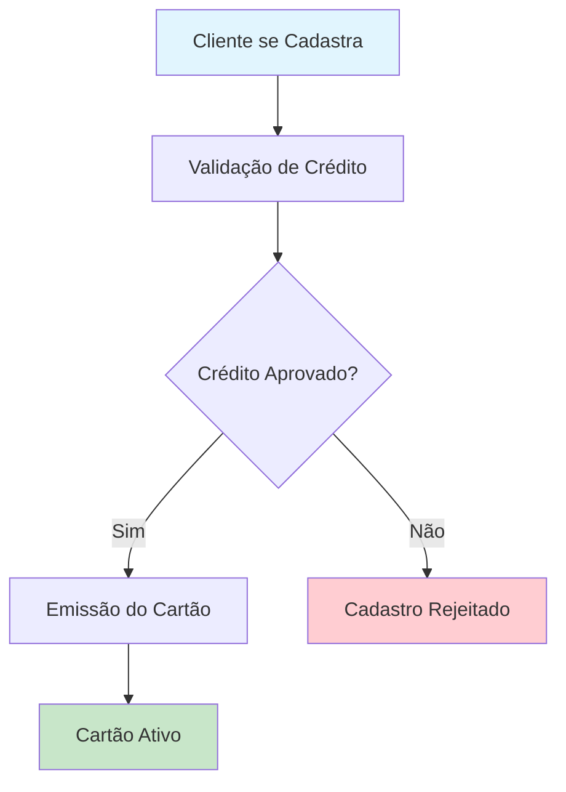

# 📚 Índice de Documentação - Sistema de Gestão Financeira

> **Central de Documentação Técnica Completa**  
> *Versão 1.0 - Novembro 2025*

---

## 🎯 Visão Geral

Este repositório contém a documentação completa do **Sistema de Gestão Financeira**, um conjunto de microserviços desenvolvidos em .NET 8.0 que implementa um pipeline completo de cadastro de clientes, validação de crédito e emissão de cartões.

### 🏗️ Arquitetura do Sistema

O sistema é composto por **3 microserviços independentes**:

1. **🆔 Cadastro de Clientes** (porta 5001)
2. **✅ Validação de Crédito** (porta 5002) 
3. **💳 Emissão de Cartões** (porta 5003)

Todos seguem os princípios de **Clean Architecture**, **Domain-Driven Design** e **Event-Driven Architecture**.

---

## 📖 Documentação Disponível

### 🚀 **NOVO** - Docker Compose

#### ⚡ [QUICK_START.md](./QUICK_START.md)
**Comece em 5 Minutos**
- Setup rápido com Docker Compose
- Validação de serviços
- Acesso imediato às APIs
- Troubleshooting básico

#### 🐳 [DOCKER_COMPOSE_GUIDE.md](./DOCKER_COMPOSE_GUIDE.md)
**Guia Completo Docker Compose**
- Configuração detalhada de todos os serviços
- Operações comuns (start, stop, logs, etc)
- Monitoramento e troubleshooting
- Segurança e escalamento
- Exemplos práticos

#### 🧪 [TEST_EXAMPLES.md](./TEST_EXAMPLES.md)
**Exemplos de Teste - API Calls**
- Autenticação JWT
- CRUD de clientes
- Análise de crédito
- Emissão de cartões
- Health checks
- Flow completo passo a passo

#### 📋 [DOCKER_SETUP_SUMMARY.md](./DOCKER_SETUP_SUMMARY.md)
**Resumo Executivo**
- Arquitetura do sistema
- Serviços configurados
- Status e monitoramento
- Segurança
- Recursos estimados

#### ✅ [SETUP_CHECKLIST.md](./SETUP_CHECKLIST.md)
**Checklist de Setup**
- Arquivos criados
- Pré-requisitos
- Passos de configuração
- Validação de serviços
- Guia de troubleshooting

---

### 🏛️ [ARCHITECTURE.md](./ARCHITECTURE.md)
**Arquitetura e Design do Sistema**
- Padrões arquiteturais utilizados
- Diagramas de componentes e fluxos
- Princípios de design aplicados
- Estrutura de camadas e responsabilidades

### 🔗 [INTEGRATION.md](./INTEGRATION.md)
**Integração e Comunicação Entre Serviços**
- Fluxos de integração e eventos
- Configuração do RabbitMQ
- Padrões de mensageria assíncrona
- Contratos de API e versionamento

### 🗄️ [DATA_STRUCTURE.md](./DATA_STRUCTURE.md)
**Estrutura de Dados e Modelagem**
- Entidades de domínio e relacionamentos
- Esquemas de banco de dados
- DTOs e contratos de API
- Migrations e versionamento de schema

### 🛠️ [DEVELOPMENT.md](./DEVELOPMENT.md)
**Guia de Desenvolvimento**
- Setup do ambiente de desenvolvimento
- Convenções de código e padrões
- Configuração de IDEs e ferramentas
- Workflow de desenvolvimento

### 📡 [API_GUIDE.md](./API_GUIDE.md)
**Guia Completo das APIs**
- Documentação detalhada de endpoints
- Exemplos de requests e responses
- Autenticação e autorização
- Códigos de erro e troubleshooting

### 🧪 [TESTING.md](./TESTING.md)
**Estratégias de Teste**
- Testes unitários, integração e E2E
- Configuração de ambiente de testes
- Cobertura de código e métricas
- Pipelines de CI/CD

### 🚀 [DEPLOYMENT.md](./DEPLOYMENT.md)
**Deploy e Infraestrutura**
- Configuração Docker e Kubernetes
- Pipelines de CI/CD
- Monitoramento e observabilidade
- Procedures de rollback

---

## 🚀 Quick Start

### ⚡ **Com Docker Compose (Recomendado - 5 minutos)**

👉 **[Leia: QUICK_START.md](./QUICK_START.md)**

```bash
# Clone o repositório
git clone <repository-url>

# Configure o ambiente
cp .env.example .env

# Inicie com Docker Compose
docker-compose up -d

# Verifique status
./docker-helper.sh status

# Acesse APIs
# http://localhost:5000/swagger     (Cadastro)
# http://localhost:5002/swagger     (Validação)
# https://localhost:7215/swagger    (Emissão)
```

### 🛠️ **Desenvolvimento Local**

👉 **[Leia: DEVELOPMENT.md](./DEVELOPMENT.md)**

```bash
# Configure .NET 8.0
dotnet --version

# Restaure dependências
dotnet restore

# Execute testes
dotnet test

# Execute o projeto
dotnet run --project Driving.Api
```

### 🧪 **Primeiros Testes de API**

👉 **[Leia: TEST_EXAMPLES.md](./TEST_EXAMPLES.md)**

```bash
# Faça login e obtenha token
curl -X POST http://localhost:5000/api/auth/login \
  -H "Content-Type: application/json" \
  -d '{"usuario":"admin","senha":"admin123"}'

# Teste criação de cliente
curl -X POST http://localhost:5000/api/clientes \
  -H "Authorization: Bearer <token>" \
  -H "Content-Type: application/json" \
  -d '{
    "nome":"João Silva",
    "email":"joao@email.com",
    "telefone":"11999999999",
    "cpf":"12345678900"
  }'
```

---

## 🔄 Fluxo Principal do Sistema



### 📊 Tecnologias Utilizadas

| Categoria | Tecnologia | Versão |
|-----------|------------|---------|
| **Framework** | .NET | 8.0 |
| **Banco de Dados** | SQLite | 3.x |
| **ORM** | Entity Framework Core | 8.0 |
| **Mensageria** | RabbitMQ | 3.x |
| **Autenticação** | JWT | - |
| **Logging** | Serilog | 3.x |
| **Testes** | xUnit | 2.x |
| **Containerização** | Docker | 24.x |
| **Orquestração** | Kubernetes | 1.28+ |

---

## 🎯 Casos de Uso Principais

### 1. **Cadastro de Cliente**
- ✅ Registro de informações pessoais
- ✅ Validação de dados obrigatórios
- ✅ Verificação de duplicatas
- ✅ Cálculo de score inicial

### 2. **Análise de Crédito**
- ✅ Processamento automático via eventos
- ✅ Algoritmos de scoring
- ✅ Aprovação/rejeição automática
- ✅ Histórico de análises

### 3. **Emissão de Cartão**
- ✅ Geração de PAN e CVV
- ✅ Tokenização de dados sensíveis
- ✅ Ativação de cartão
- ✅ Controle de estados

---

## 📋 Padrões e Convenções

### 🏗️ **Arquitetura**
- **Clean Architecture** com separação clara de responsabilidades
- **Domain-Driven Design** para modelagem de negócio
- **CQRS** para separação de comandos e consultas
- **Event Sourcing** para auditoria e histórico

### 🔧 **Desenvolvimento**
- **Repository Pattern** para acesso a dados
- **Unit of Work** para transações
- **Dependency Injection** nativo do .NET
- **FluentValidation** para validações

### 🧪 **Testes**
- **Test-Driven Development** (TDD)
- **Cobertura mínima de 80%**
- **Testes de contrato** para APIs
- **Testes de integração** para fluxos críticos

---

## 🔍 Navegação Rápida

### 📚 **Para Desenvolvedores**
- [Setup do Ambiente](./DEVELOPMENT.md#-setup-do-ambiente)
- [Convenções de Código](./DEVELOPMENT.md#-convenções-de-código)
- [Debugging](./DEVELOPMENT.md#-debugging-e-troubleshooting)

### 🏗️ **Para Arquitetos**
- [Decisões Arquiteturais](./ARCHITECTURE.md#-decisões-arquiteturais)
- [Padrões Utilizados](./ARCHITECTURE.md#️-padrões-arquiteturais)
- [Diagramas](./ARCHITECTURE.md#-diagramas)

### 🚀 **Para DevOps**
- [Configuração Docker](./DEPLOYMENT.md#-deploy-com-docker)
- [Kubernetes](./DEPLOYMENT.md#️-deploy-com-kubernetes)
- [CI/CD](./DEPLOYMENT.md#-cicd-pipeline)
- [Monitoramento](./DEPLOYMENT.md#-monitoramento-e-observabilidade)

### 🧪 **Para QA**
- [Estratégias de Teste](./TESTING.md#-estratégias-de-teste)
- [Testes Automatizados](./TESTING.md#-testes-automatizados)
- [Ambientes de Teste](./TESTING.md#-ambientes-de-teste)

### 📡 **Para Integradores**
- [APIs Disponíveis](./API_GUIDE.md#-apis-disponíveis)
- [Autenticação](./API_GUIDE.md#-autenticação)
- [Exemplos de Uso](./API_GUIDE.md#-exemplos-práticos)

---

## ⚡ Métricas e Performance

### 📊 **SLAs Definidos**
- **Disponibilidade:** 99.9%
- **Tempo de Resposta:** < 200ms (P95)
- **Throughput:** 1000 req/min por serviço
- **Recovery Time:** < 5 minutos

### 🔍 **Monitoramento**
- **Health Checks** em todos os endpoints
- **Métricas customizadas** com Prometheus
- **Logs estruturados** com correlation IDs
- **Alertas proativos** via Grafana

---

## 🔐 Segurança

### 🛡️ **Medidas Implementadas**
- **Autenticação JWT** com refresh tokens
- **Autorização baseada em roles**
- **Rate limiting** nas APIs
- **Validação de entrada** rigorosa
- **Logs de auditoria** completos

### 🔒 **Conformidade**
- **LGPD** - Proteção de dados pessoais
- **PCI DSS** - Segurança de dados de cartão
- **OWASP Top 10** - Proteções implementadas

---

## 🆘 Suporte e Troubleshooting

### 📞 **Contatos**
- **Equipe de Desenvolvimento:** dev-team@company.com
- **Suporte Técnico:** support@company.com
- **Emergências:** +55 11 9999-9999

### 🐛 **Problemas Comuns**
- [Falhas de Conexão](./DEVELOPMENT.md#-problemas-comuns)
- [Erros de Autenticação](./API_GUIDE.md#-troubleshooting)
- [Problemas de Performance](./DEPLOYMENT.md#-monitoramento)

---

## 📈 Roadmap

### 🎯 **Próximas Versões**
- **v2.0** - Migração para PostgreSQL
- **v2.1** - Implementação de Gateway API
- **v2.2** - Cache distribuído com Redis
- **v3.0** - Microserviços adicionais (Transações)

---

## 📝 Contribuição

Para contribuir com este projeto:

1. 📖 Leia o [Guia de Desenvolvimento](./DEVELOPMENT.md)
2. 🧪 Execute todos os [Testes](./TESTING.md)
3. 📋 Siga as [Convenções de Código](./DEVELOPMENT.md#-convenções-de-código)
4. 📄 Atualize a documentação relevante

---

## 📄 Licença

Este projeto está licenciado sob os termos da licença MIT. Veja o arquivo `LICENSE` para mais detalhes.

---

**📚 Esta documentação é mantida atualizada pela equipe de desenvolvimento. Última atualização: Novembro 2025**