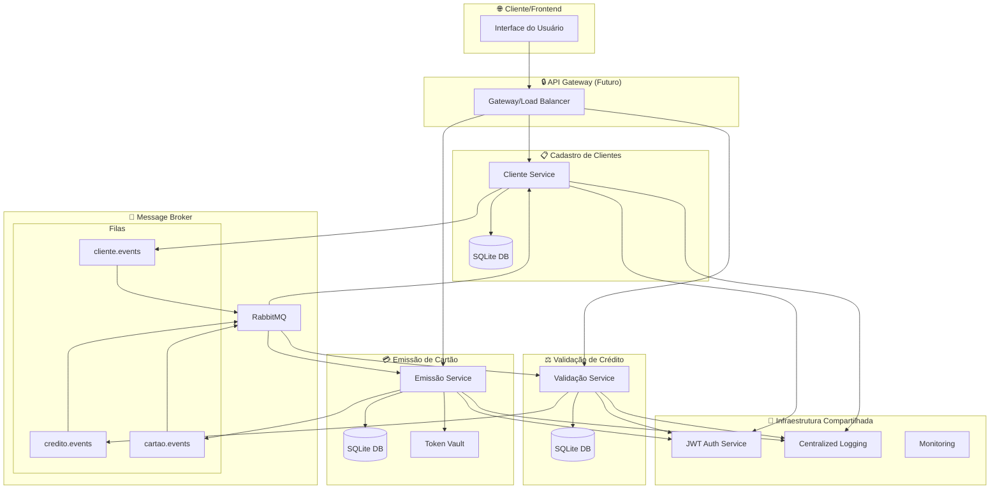
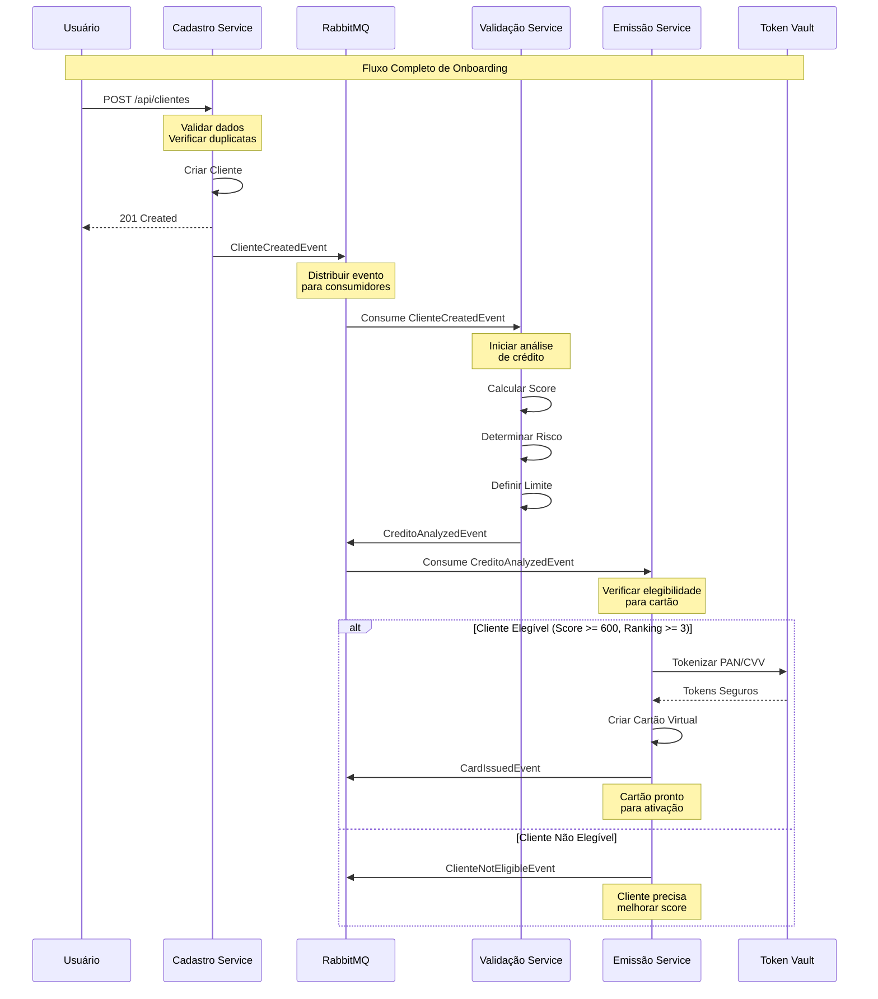
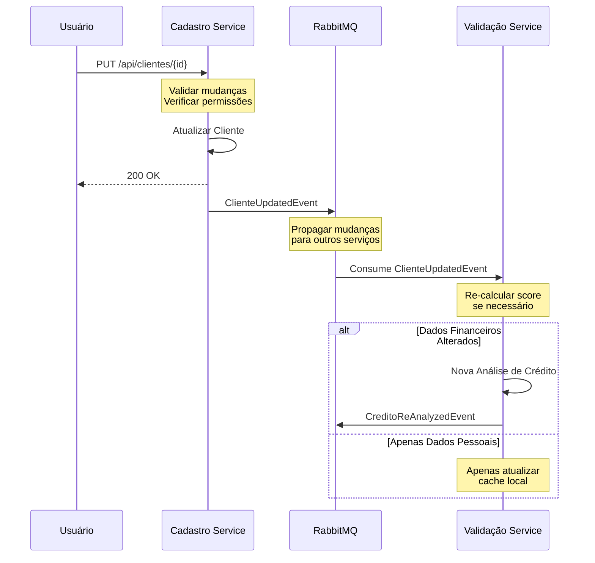
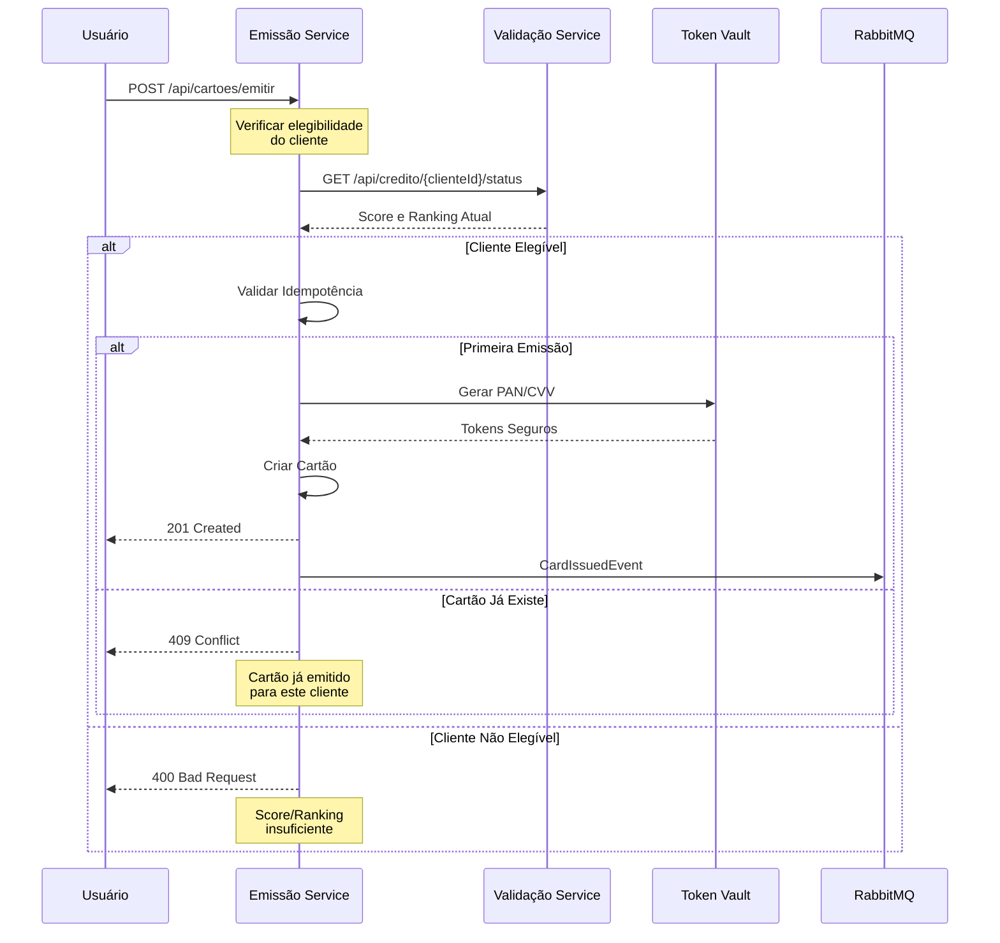
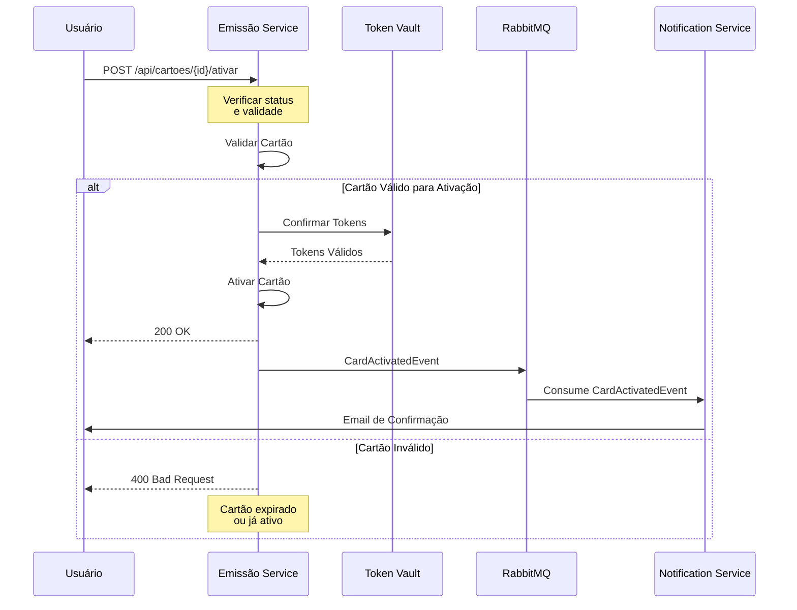
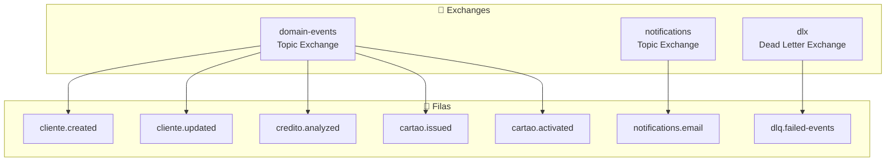

# 🔗 Documentação de Integração - Sistema de Gestão Financeira

> **Diagramas e Fluxos de Integração entre Microserviços**  
> *Versão 1.0 - Novembro 2025*

---

## 🎯 Visão Geral das Integrações

O sistema implementa uma **arquitetura orientada a eventos** com comunicação assíncrona via **RabbitMQ**, garantindo **baixo acoplamento** e **alta escalabilidade** entre os microserviços.



---

## 📊 Fluxos de Integração Principais

### 1. 🔄 Fluxo Completo: Cadastro → Análise → Emissão



### 2. 📝 Fluxo de Atualização de Cliente



### 3. 💳 Fluxo de Emissão de Cartão



### 4. 🔓 Fluxo de Ativação de Cartão



---

## 🐰 Configuração do RabbitMQ

### 1. Topologia de Exchanges e Filas



### 2. Configuração de Exchanges

```json
{
  "exchanges": [
    {
      "name": "domain-events",
      "type": "topic",
      "durable": true,
      "auto_delete": false,
      "arguments": {}
    },
    {
      "name": "notifications",
      "type": "topic", 
      "durable": true,
      "auto_delete": false,
      "arguments": {}
    },
    {
      "name": "dlx",
      "type": "direct",
      "durable": true,
      "auto_delete": false,
      "arguments": {}
    }
  ]
}
```

### 3. Configuração de Filas com Dead Letter

```json
{
  "queues": [
    {
      "name": "cliente.created",
      "durable": true,
      "exclusive": false,
      "auto_delete": false,
      "arguments": {
        "x-dead-letter-exchange": "dlx",
        "x-dead-letter-routing-key": "failed",
        "x-message-ttl": 86400000,
        "x-max-retries": 3
      }
    },
    {
      "name": "credito.analyzed",
      "durable": true,
      "exclusive": false,
      "auto_delete": false,
      "arguments": {
        "x-dead-letter-exchange": "dlx",
        "x-dead-letter-routing-key": "failed",
        "x-message-ttl": 86400000,
        "x-max-retries": 3
      }
    }
  ]
}
```

### 4. Bindings de Routing Keys

```json
{
  "bindings": [
    {
      "source": "domain-events",
      "destination": "cliente.created",
      "routing_key": "clientecreatedevent"
    },
    {
      "source": "domain-events", 
      "destination": "cliente.updated",
      "routing_key": "clienteupdatedevent"
    },
    {
      "source": "domain-events",
      "destination": "credito.analyzed", 
      "routing_key": "creditoanalyzedevent"
    },
    {
      "source": "domain-events",
      "destination": "cartao.issued",
      "routing_key": "cardissuedevent"
    }
  ]
}
```

---

## 📋 Eventos do Sistema

### 1. Eventos de Cliente

#### ClienteCreatedEvent
```json
{
  "eventId": "uuid",
  "eventType": "ClienteCreatedEvent",
  "timestamp": "2025-11-03T10:30:00Z",
  "aggregateId": "cliente-uuid",
  "version": 1,
  "data": {
    "clienteId": "uuid",
    "nome": "João Silva",
    "email": "joao@email.com",
    "cpf": "12345678901",
    "telefone": "11999999999",
    "endereco": "Rua A, 123",
    "cidade": "São Paulo",
    "estado": "SP",
    "cep": "01234567",
    "scoreInicial": 0,
    "rankingInicial": 0
  }
}
```

#### ClienteUpdatedEvent
```json
{
  "eventId": "uuid",
  "eventType": "ClienteUpdatedEvent", 
  "timestamp": "2025-11-03T10:35:00Z",
  "aggregateId": "cliente-uuid",
  "version": 2,
  "data": {
    "clienteId": "uuid",
    "camposAlterados": ["telefone", "endereco"],
    "valoresAnteriores": {
      "telefone": "11888888888",
      "endereco": "Rua B, 456"
    },
    "valoresNovos": {
      "telefone": "11999999999", 
      "endereco": "Rua A, 123"
    },
    "dataAtualizacao": "2025-11-03T10:35:00Z",
    "atualizadoPor": "admin"
  }
}
```

### 2. Eventos de Crédito

#### CreditoAnalyzedEvent
```json
{
  "eventId": "uuid",
  "eventType": "CreditoAnalyzedEvent",
  "timestamp": "2025-11-03T10:32:00Z", 
  "aggregateId": "analise-uuid",
  "version": 1,
  "data": {
    "clienteId": "uuid",
    "scoreAnterior": 0,
    "scoreAtual": 750,
    "nivelRisco": "BAIXO",
    "limiteAprovado": 5000.00,
    "elegibleParaCartao": true,
    "motivoAnalise": "CLIENTE_NOVO",
    "dataAnalise": "2025-11-03T10:32:00Z"
  }
}
```

### 3. Eventos de Cartão

#### CardIssuedEvent
```json
{
  "eventId": "uuid",
  "eventType": "CardIssuedEvent",
  "timestamp": "2025-11-03T10:33:00Z",
  "aggregateId": "cartao-uuid", 
  "version": 1,
  "data": {
    "cartaoId": "uuid",
    "clienteId": "uuid",
    "propostaId": "uuid",
    "contaId": "uuid",
    "codigoProduto": "VISA_GOLD",
    "tipo": "VIRTUAL",
    "status": "EMITIDO",
    "mesValidade": 11,
    "anoValidade": 2029,
    "dataEmissao": "2025-11-03T10:33:00Z",
    "canalEmissao": "API"
  }
}
```

#### CardActivatedEvent
```json
{
  "eventId": "uuid",
  "eventType": "CardActivatedEvent",
  "timestamp": "2025-11-03T11:00:00Z",
  "aggregateId": "cartao-uuid",
  "version": 2,
  "data": {
    "cartaoId": "uuid",
    "clienteId": "uuid", 
    "dataAtivacao": "2025-11-03T11:00:00Z",
    "canalAtivacao": "MOBILE_APP",
    "ipAtivacao": "192.168.1.100",
    "localizacao": {
      "latitude": -23.5505,
      "longitude": -46.6333,
      "cidade": "São Paulo",
      "estado": "SP"
    }
  }
}
```

---

## 🔧 Implementação dos Publishers/Consumers

### 1. Publisher Genérico

```csharp
public class MessagePublisher : IMessagePublisher
{
    private readonly IConnection _connection;
    private readonly IModel _channel;
    private readonly ILogger<MessagePublisher> _logger;
    private readonly RabbitMQSettings _settings;

    public async Task PublishAsync<T>(T domainEvent) where T : DomainEvent
    {
        var routingKey = typeof(T).Name.ToLowerInvariant();
        var exchange = "domain-events";
        
        var message = JsonSerializer.Serialize(domainEvent, new JsonSerializerOptions
        {
            PropertyNamingPolicy = JsonNamingPolicy.CamelCase
        });
        
        var body = Encoding.UTF8.GetBytes(message);
        
        var properties = _channel.CreateBasicProperties();
        properties.Persistent = true;
        properties.MessageId = domainEvent.EventId.ToString();
        properties.CorrelationId = domainEvent.CorrelationId;
        properties.Timestamp = new AmqpTimestamp(
            ((DateTimeOffset)domainEvent.Timestamp).ToUnixTimeSeconds());
        properties.ContentType = "application/json";
        properties.ContentEncoding = "utf-8";

        try
        {
            _channel.BasicPublish(
                exchange: exchange,
                routingKey: routingKey,
                basicProperties: properties,
                body: body);

            _logger.LogInformation(
                "Evento {EventType} publicado com sucesso. " +
                "MessageId: {MessageId}, CorrelationId: {CorrelationId}",
                typeof(T).Name, properties.MessageId, properties.CorrelationId);
        }
        catch (Exception ex)
        {
            _logger.LogError(ex,
                "Erro ao publicar evento {EventType}. MessageId: {MessageId}",
                typeof(T).Name, properties.MessageId);
            throw;
        }
    }
}
```

### 2. Consumer Base com Retry

```csharp
public abstract class BaseMessageConsumer<T> : IMessageConsumer where T : DomainEvent
{
    private readonly IModel _channel;
    private readonly ILogger _logger;
    private readonly string _queueName;

    protected abstract Task ProcessEventAsync(T domainEvent);

    public void StartConsuming()
    {
        var consumer = new EventingBasicConsumer(_channel);
        
        consumer.Received += async (model, args) =>
        {
            var correlationId = args.BasicProperties.CorrelationId;
            var messageId = args.BasicProperties.MessageId;
            
            try
            {
                var message = Encoding.UTF8.GetString(args.Body.ToArray());
                var domainEvent = JsonSerializer.Deserialize<T>(message, new JsonSerializerOptions
                {
                    PropertyNamingPolicy = JsonNamingPolicy.CamelCase
                });

                _logger.LogInformation(
                    "Processando evento {EventType}. MessageId: {MessageId}, CorrelationId: {CorrelationId}",
                    typeof(T).Name, messageId, correlationId);

                await ProcessEventAsync(domainEvent);

                // ACK apenas se processamento foi bem-sucedido
                _channel.BasicAck(args.DeliveryTag, false);

                _logger.LogInformation(
                    "Evento {EventType} processado com sucesso. MessageId: {MessageId}",
                    typeof(T).Name, messageId);
            }
            catch (Exception ex)
            {
                _logger.LogError(ex,
                    "Erro ao processar evento {EventType}. MessageId: {MessageId}",
                    typeof(T).Name, messageId);

                // NACK com requeue para retry
                var retryCount = GetRetryCount(args.BasicProperties);
                if (retryCount < 3)
                {
                    _channel.BasicNack(args.DeliveryTag, false, true);
                }
                else
                {
                    // Enviar para Dead Letter Queue após 3 tentativas
                    _channel.BasicNack(args.DeliveryTag, false, false);
                }
            }
        };

        _channel.BasicConsume(queue: _queueName, autoAck: false, consumer: consumer);
    }
}
```

### 3. Consumer Específico - Análise de Crédito

```csharp
public class ClienteCreatedEventConsumer : BaseMessageConsumer<ClienteCreatedEvent>
{
    private readonly ICreditoService _creditoService;
    private readonly ILogger<ClienteCreatedEventConsumer> _logger;

    public ClienteCreatedEventConsumer(
        ICreditoService creditoService,
        IModel channel,
        ILogger<ClienteCreatedEventConsumer> logger) 
        : base(channel, logger, "cliente.created")
    {
        _creditoService = creditoService;
        _logger = logger;
    }

    protected override async Task ProcessEventAsync(ClienteCreatedEvent domainEvent)
    {
        try
        {
            _logger.LogInformation(
                "Iniciando análise de crédito para cliente {ClienteId}",
                domainEvent.Data.ClienteId);

            // Executar análise de crédito
            var analiseRequest = new AnalisarCreditoDto
            {
                ClienteId = domainEvent.Data.ClienteId,
                Nome = domainEvent.Data.Nome,
                CPF = domainEvent.Data.Cpf,
                RendaDeclarada = 0, // Valor padrão para novos clientes
                MotivoAnalise = "CLIENTE_NOVO"
            };

            var resultado = await _creditoService.AnalisarCreditoAsync(analiseRequest);

            if (resultado.Sucesso)
            {
                _logger.LogInformation(
                    "Análise de crédito concluída para cliente {ClienteId}. Score: {Score}",
                    domainEvent.Data.ClienteId, resultado.Dados.ScoreCalculado);
            }
            else
            {
                _logger.LogWarning(
                    "Falha na análise de crédito para cliente {ClienteId}. Erros: {Erros}",
                    domainEvent.Data.ClienteId, string.Join(", ", resultado.Erros));
            }
        }
        catch (Exception ex)
        {
            _logger.LogError(ex,
                "Erro inesperado ao processar ClienteCreatedEvent para cliente {ClienteId}",
                domainEvent.Data.ClienteId);
            throw; // Re-throw para trigger retry mechanism
        }
    }
}
```

---

## 🔄 Padrão Outbox

### 1. Implementação da Entidade Outbox

```csharp
public class OutboxEvent : BaseEntity
{
    public string Topico { get; set; } = string.Empty;
    public string Payload { get; set; } = string.Empty;
    public DateTime? DataEnvio { get; set; }
    public bool Processado { get; set; } = false;
    public int TentativasEnvio { get; set; } = 0;
    public DateTime? ProximaTentativa { get; set; }
    public string? ErroUltimaeTentativa { get; set; }

    public void MarcarComoProcessado()
    {
        Processado = true;
        DataEnvio = DateTime.UtcNow;
        DataAtualizacao = DateTime.UtcNow;
    }

    public void IncrementarTentativa(string erro)
    {
        TentativasEnvio++;
        ErroUltimaeTentativa = erro;
        ProximaTentativa = DateTime.UtcNow.AddMinutes(Math.Pow(2, TentativasEnvio));
        DataAtualizacao = DateTime.UtcNow;
    }
}
```

### 2. Outbox Dispatcher

```csharp
public class OutboxDispatcher : BackgroundService
{
    private readonly IServiceProvider _serviceProvider;
    private readonly ILogger<OutboxDispatcher> _logger;
    private readonly TimeSpan _interval = TimeSpan.FromSeconds(30);

    protected override async Task ExecuteAsync(CancellationToken stoppingToken)
    {
        while (!stoppingToken.IsCancellationRequested)
        {
            try
            {
                await ProcessPendingEventsAsync();
            }
            catch (Exception ex)
            {
                _logger.LogError(ex, "Erro no processamento do Outbox");
            }

            await Task.Delay(_interval, stoppingToken);
        }
    }

    private async Task ProcessPendingEventsAsync()
    {
        using var scope = _serviceProvider.CreateScope();
        var repository = scope.ServiceProvider.GetRequiredService<IOutboxRepository>();
        var publisher = scope.ServiceProvider.GetRequiredService<IMessagePublisher>();

        var pendingEvents = await repository.ObterEventosPendentesAsync();

        foreach (var outboxEvent in pendingEvents)
        {
            try
            {
                // Deserializar e publicar evento
                var domainEvent = JsonSerializer.Deserialize<DomainEvent>(outboxEvent.Payload);
                await publisher.PublishAsync(domainEvent);

                // Marcar como processado
                outboxEvent.MarcarComoProcessado();
                await repository.AtualizarAsync(outboxEvent);

                _logger.LogInformation(
                    "Evento {EventId} processado com sucesso via Outbox",
                    outboxEvent.Id);
            }
            catch (Exception ex)
            {
                outboxEvent.IncrementarTentativa(ex.Message);
                await repository.AtualizarAsync(outboxEvent);

                _logger.LogError(ex,
                    "Erro ao processar evento {EventId} via Outbox. Tentativa {Tentativa}",
                    outboxEvent.Id, outboxEvent.TentativasEnvio);
            }
        }
    }
}
```

---

## 📊 Monitoramento e Observabilidade

### 1. Health Checks para Integrações

```csharp
public class RabbitMQHealthCheck : IHealthCheck
{
    private readonly IConnection _connection;

    public Task<HealthCheckResult> CheckHealthAsync(
        HealthCheckContext context, 
        CancellationToken cancellationToken = default)
    {
        try
        {
            if (_connection?.IsOpen == true)
            {
                return Task.FromResult(HealthCheckResult.Healthy("RabbitMQ connection is healthy"));
            }
            
            return Task.FromResult(HealthCheckResult.Unhealthy("RabbitMQ connection is closed"));
        }
        catch (Exception ex)
        {
            return Task.FromResult(HealthCheckResult.Unhealthy("RabbitMQ health check failed", ex));
        }
    }
}
```

### 2. Métricas de Mensageria

```csharp
public class MessageMetrics
{
    private readonly IMetricsCollector _metrics;

    public void RecordMessagePublished(string eventType)
    {
        _metrics.Increment("messages_published_total", 
            new[] { ("event_type", eventType) });
    }

    public void RecordMessageProcessed(string eventType, bool success, TimeSpan processingTime)
    {
        _metrics.Increment("messages_processed_total", 
            new[] { ("event_type", eventType), ("status", success ? "success" : "failure") });
        
        _metrics.RecordValue("message_processing_duration_ms", 
            processingTime.TotalMilliseconds,
            new[] { ("event_type", eventType) });
    }

    public void RecordMessageRetry(string eventType, int retryCount)
    {
        _metrics.Increment("message_retries_total",
            new[] { ("event_type", eventType), ("retry_count", retryCount.ToString()) });
    }
}
```

---

## 🎯 Boas Práticas de Integração

### 1. **Idempotência**
- Todos os eventos possuem IDs únicos
- Consumers devem ser preparados para processar o mesmo evento múltiplas vezes
- Uso de chaves de idempotência em operações críticas

### 2. **Resilência**
- Retry automático com backoff exponencial
- Dead Letter Queues para eventos com falha persistente
- Circuit breaker para proteger serviços downstream

### 3. **Observabilidade**
- Correlation IDs em todas as mensagens
- Logging estruturado com contexto completo
- Métricas de performance e taxa de erro

### 4. **Versionamento**
- Eventos possuem versionamento para evolução compatível
- Suporte a múltiplas versões durante transições
- Schema registry para validação de contratos

### 5. **Segurança**
- Autenticação entre serviços via certificados
- Criptografia de payloads sensíveis
- Auditoria completa de eventos

---

**🔗 Esta arquitetura de integração garante comunicação robusta, escalável e observável entre todos os microserviços do sistema.**