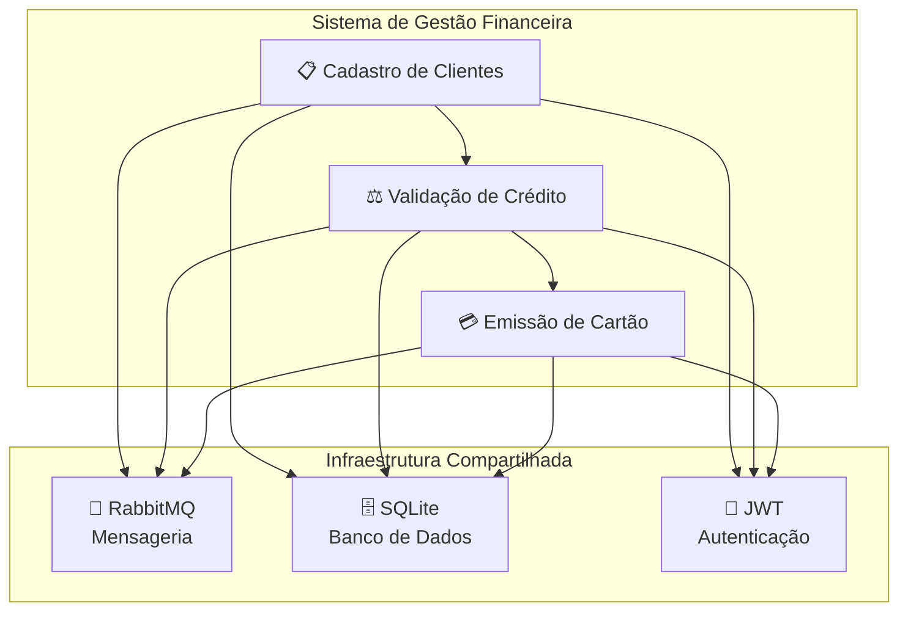
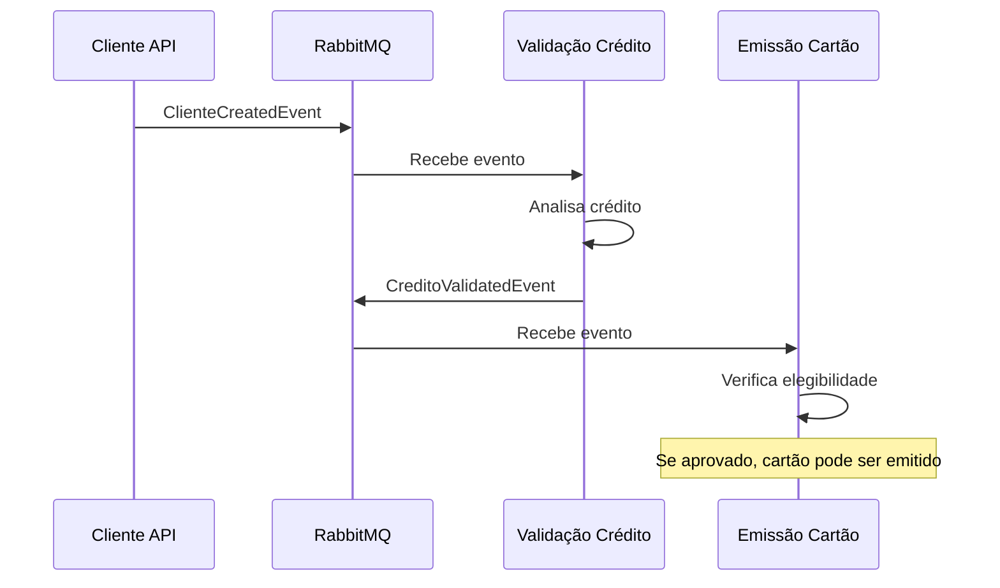

# 📚 Sistema de Gestão Financeira - Documentação Técnica

> **Documentação Centralizada dos Microserviços de Gestão Financeira**  
> *Versão 1.0 - Novembro 2025*

---

## 🎯 Visão Geral do Sistema

Este sistema é composto por **três microserviços independentes** que trabalham em conjunto para fornecer uma solução completa de gestão financeira e emissão de cartões de crédito:



---

## 🏗️ Microserviços

### 1. 📋 Cadastro de Clientes (`teste-cadastro.cliente`)
**Porta:** `5001` | **Responsabilidade:** Gestão completa do ciclo de vida de clientes

- ✅ **CRUD de Clientes** - Criar, listar, atualizar e excluir clientes
- ✅ **Validação de Dados** - CPF, email, telefone e endereço  
- ✅ **Autenticação JWT** - Login seguro para acesso às APIs
- ✅ **Auditoria** - Controle de criação, atualização e soft delete
- ✅ **Score Inicial** - Definição de ranking e score de crédito básico

**APIs Principais:**
- `POST /api/auth/login` - Autenticação de usuários
- `POST /api/clientes` - Criar novo cliente
- `GET /api/clientes` - Listar clientes (paginado)
- `PUT /api/clientes/{id}` - Atualizar cliente
- `DELETE /api/clientes/{id}` - Exclusão lógica

### 2. ⚖️ Validação de Crédito (`teste-validacao.credito`)
**Porta:** `5002` | **Responsabilidade:** Análise e aprovação de crédito

- ✅ **Análise de Crédito** - Algoritmos de scoring e aprovação
- ✅ **Atualização de Score** - Recálculo baseado em novos dados
- ✅ **Níveis de Risco** - Classificação: Baixo, Moderado, Alto
- ✅ **Limites de Crédito** - Cálculo automático baseado no score
- ✅ **Histórico** - Rastreamento de todas as análises

**APIs Principais:**
- `POST /api/credito/analisar` - Solicitar análise de crédito
- `PUT /api/credito/{clienteId}/score` - Atualizar score manualmente
- `GET /api/credito/{clienteId}/historico` - Histórico de análises

### 3. 💳 Emissão de Cartão (`teste-emissao.cartao`)
**Porta:** `5003` | **Responsabilidade:** Emissão e gestão de cartões de crédito

- ✅ **Emissão de Cartões** - Virtual e físico com validações de elegibilidade
- ✅ **Ativação de Cartões** - Processo seguro de ativação
- ✅ **Tokenização** - PAN e CVV nunca armazenados em claro
- ✅ **Gestão de Produtos** - Diferentes tipos de cartão (Gold, Platinum)
- ✅ **Idempotência** - Prevenção de duplicatas na emissão

**APIs Principais:**
- `POST /api/cartoes/emitir` - Emitir novo cartão
- `POST /api/cartoes/{id}/ativar` - Ativar cartão emitido
- `GET /api/cartoes/cliente/{clienteId}` - Listar cartões do cliente

---

## 🛠️ Tecnologias e Padrões

### Stack Técnica
- **🔨 Framework:** .NET 8.0
- **🗄️ Banco de Dados:** SQLite com Entity Framework Core
- **🐰 Mensageria:** RabbitMQ para comunicação assíncrona
- **🔐 Autenticação:** JWT (JSON Web Tokens)
- **📊 Logging:** Serilog estruturado
- **🧪 Testes:** xUnit com mocks e builders
- **📋 Documentação:** Swagger/OpenAPI

### Padrões Arquiteturais
- **🏗️ Clean Architecture** - Separação clara de responsabilidades
- **🔷 Domain-Driven Design (DDD)** - Modelagem rica do domínio
- **⚡ CQRS Pattern** - Separação de comandos e consultas
- **📤 Outbox Pattern** - Garantia de entrega de eventos
- **🔄 Repository Pattern** - Abstração da camada de dados
- **🗂️ Dependency Injection** - Inversão de controle

---

## 📁 Estrutura de Pastas Padronizada

Todos os microserviços seguem a mesma estrutura organizacional:

```
📦 [microservico]/
├── 🎯 Core.Application/          # Casos de uso e lógica de aplicação
│   ├── DTOs/                    # Data Transfer Objects
│   ├── Interfaces/              # Contratos de serviços
│   ├── Services/                # Implementação dos casos de uso
│   ├── Mappers/                 # Conversão entre entidades e DTOs
│   └── Validators/              # Validações de entrada
├── 🏛️ Core.Domain/              # Modelo de domínio
│   ├── Entities/                # Entidades ricas do domínio
│   ├── Common/                  # Classes base e helpers
│   └── Interfaces/              # Contratos de repositórios
├── 🔧 Core.Infra/               # Serviços de infraestrutura
│   ├── Logging/                 # Configuração de logs
│   ├── Caching/                 # Cache em memória
│   └── Email/                   # Serviços de notificação
├── 🔌 Driven.SqlLite/           # Adaptador de banco de dados
│   ├── Data/                    # DbContext e configurações EF
│   ├── Repositories/            # Implementação dos repositórios
│   └── Migrations/              # Migrações do banco
├── 🐰 Driven.RabbitMQ/          # Adaptador de mensageria
│   ├── Services/                # Publishers e consumers
│   ├── Events/                  # Eventos de domínio
│   └── Settings/                # Configurações do RabbitMQ
├── 🌐 Driving.Api/              # Camada de apresentação
│   ├── Controllers/             # Endpoints REST
│   ├── Extensions/              # Configurações e middlewares
│   └── Program.cs               # Configuração da aplicação
└── 🧪 Test.XUnit/               # Testes automatizados
    ├── Application/             # Testes de serviços
    ├── Controllers/             # Testes de API
    ├── Domain/                  # Testes de entidades
    └── Builders/                # Test builders para mocks
```

---

## 🔗 Comunicação Entre Serviços

### Padrão de Eventos (Event-Driven)


### Tipos de Eventos
- **`ClienteCreatedEvent`** - Novo cliente cadastrado
- **`ClienteUpdatedEvent`** - Dados do cliente atualizados  
- **`CreditoValidatedEvent`** - Análise de crédito concluída
- **`CardIssuedEvent`** - Cartão emitido com sucesso
- **`CardActivatedEvent`** - Cartão ativado pelo cliente

---

## 🚀 Como Executar o Sistema

### Pré-requisitos
- ✅ .NET 8.0 SDK
- ✅ Docker e Docker Compose
- ✅ Visual Studio 2022 ou VS Code

### Opção 1: Docker Compose (Recomendado)

#### 1. Configurar Variáveis de Ambiente
```bash
# Copiar arquivo de exemplo
cp .env.example .env

# Editar .env com suas credenciais JWT
# JWT_SECRET=sua-chave-super-secreta-com-minimo-32-caracteres
```

#### 2. Iniciar o Sistema
```bash
# Build e inicia todos os serviços
docker-compose up -d

# Verificar status dos containers
docker-compose ps

# Ver logs
docker-compose logs -f
```

#### 3. Acessar Serviços
- 📋 Cadastro Cliente: http://localhost:5000/swagger
- ⚖️ Validação Crédito: http://localhost:5002/swagger
- 💳 Emissão Cartão: https://localhost:7215/swagger
- 🐰 RabbitMQ Management: http://localhost:15672 (guest/guest)

#### 4. Parar o Sistema
```bash
docker-compose down

# Remover volumes (dados)
docker-compose down -v
```

---

### Opção 2: Execução Local (Desenvolvimento)

#### 1. Infraestrutura
```bash
# Subir RabbitMQ
docker run -d --name rabbitmq \
  -p 5672:5672 -p 15672:15672 \
  rabbitmq:3-management

# Acessar Management UI: http://localhost:15672 (guest/guest)
```

#### 2. Executar Microserviços
```bash
# Terminal 1 - Cadastro de Clientes
cd teste-cadastro.cliente/Driving.Api
dotnet run --urls="http://localhost:5000"

# Terminal 2 - Validação de Crédito
cd teste-validacao.credito/Driving.Api
dotnet run --urls="http://localhost:5002"

# Terminal 3 - Emissão de Cartão
cd teste-emissao.cartao/Driving.Api
dotnet run --urls="https://localhost:7215"
```

#### 3. Acessar Documentação
- 📋 Cadastro: http://localhost:5000/swagger
- ⚖️ Validação: http://localhost:5002/swagger
- 💳 Emissão: https://localhost:7215/swagger

---

### Configuração do Docker Compose

O arquivo `docker-compose.yml` configura:

| Serviço | Porta | Container | Dados |
|---------|-------|-----------|-------|
| Cadastro Cliente | 5000 | cadastro-cliente | ./data/cliente |
| Validação Crédito | 5002 | validacao-credito | ./data/credito |
| Emissão Cartão | 7215 | emissao-cartao | ./data/cartao |
| RabbitMQ AMQP | 5672 | rabbitmq | volume rabbitmq_data |
| RabbitMQ Management | 15672 | rabbitmq | - |

**Variáveis de Ambiente:**
- Copie `.env.example` para `.env`
- Atualize `JWT_SECRET` com uma chave forte
- Ajuste Email/SMTP se necessário

**Health Checks:**
- Cada serviço verifica /health a cada 30 segundos
- Inicializa com grace period de 40 segundos

---

## 📚 Documentação Detalhada

### Arquitetura e Design
- 🏗️ **[ARCHITECTURE.md](./ARCHITECTURE.md)** - Padrões arquiteturais e estrutura detalhada
- 🔗 **[INTEGRATION.md](./INTEGRATION.md)** - Diagramas e fluxos de integração
- 🗄️ **[DATA_STRUCTURE.md](./DATA_STRUCTURE.md)** - Modelos de dados e relacionamentos

### Desenvolvimento
- 👨‍💻 **[DEVELOPMENT.md](./DEVELOPMENT.md)** - Guia para desenvolvedores
- 📡 **[API_GUIDE.md](./API_GUIDE.md)** - Documentação completa das APIs
- 🧪 **[TESTING.md](./TESTING.md)** - Estratégias e padrões de teste

### Operação
- 🚀 **[DEPLOYMENT.md](./DEPLOYMENT.md)** - Guia de deploy e configuração
- 📊 **[MONITORING.md](./MONITORING.md)** - Logs, métricas e observabilidade
- 🐛 **[TROUBLESHOOTING.md](./TROUBLESHOOTING.md)** - Resolução de problemas comuns

---

## 👥 Equipe e Contato

**Arquiteto de Software:** Oliveira Dev Tech  
**Data de Criação:** Novembro 2025  
**Versão da Documentação:** 1.0

---

## 📋 Status dos Projetos

| Microserviço | Status | Cobertura de Testes | Última Atualização |
|--------------|--------|-------------------|-------------------|
| 📋 Cadastro Cliente | ✅ Produção | 85%+ | Nov 2025 |
| ⚖️ Validação Crédito | ✅ Produção | 80%+ | Nov 2025 |
| 💳 Emissão Cartão | ✅ Produção | 90%+ | Nov 2025 |

---

**💡 Esta documentação é viva e deve ser atualizada conforme o sistema evolui.**
